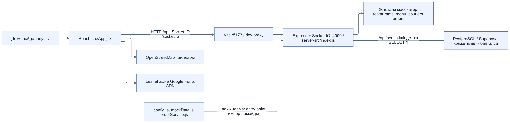
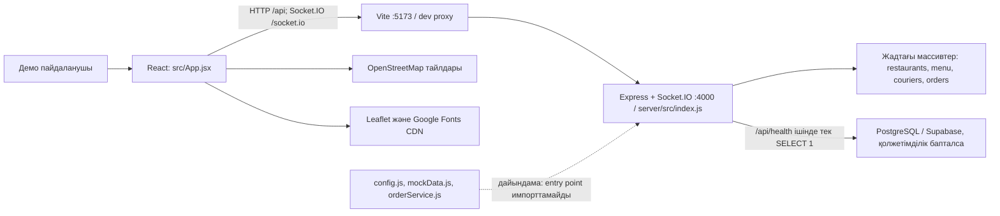
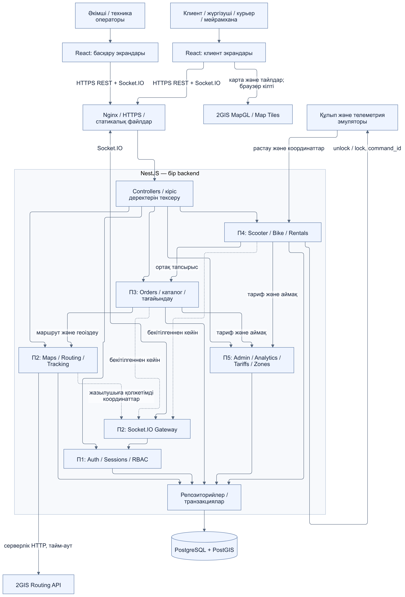
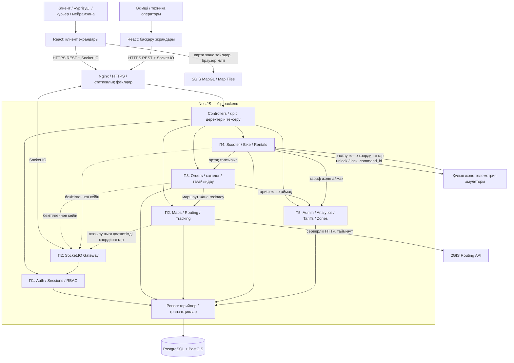
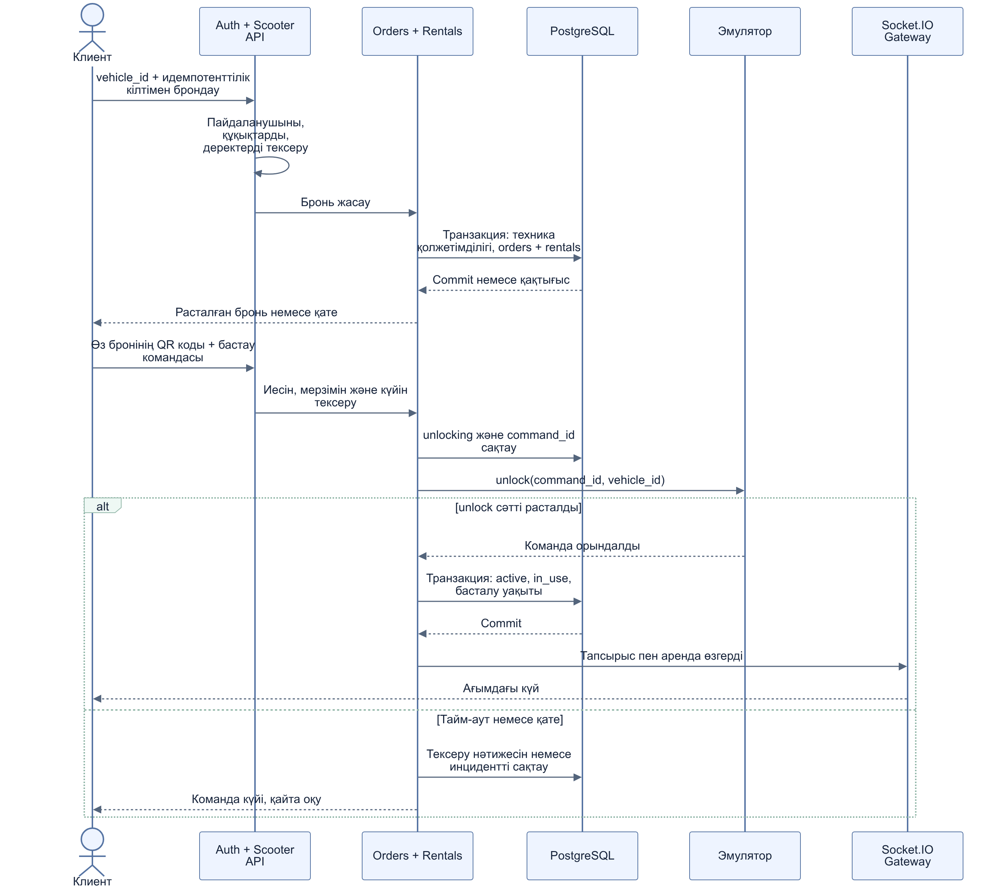
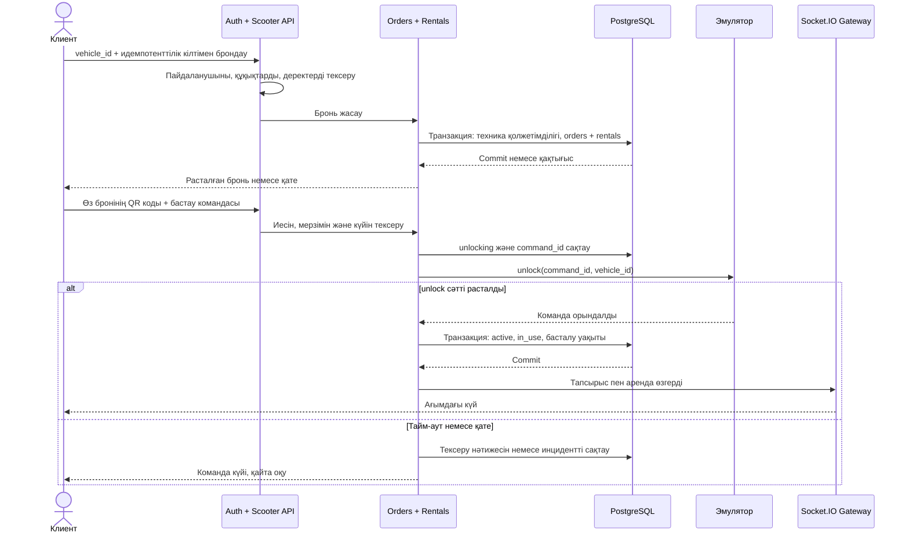

# YaGo жалпы архитектурасы

[Аптаның барлық материалдары](../../README.md) · [Орысша](../ru/02-system-architecture.md)

**Версия:** 1.0, 24.09.2026. **Жауапты:** П2 — Maps & Real-time.

## 1. Қазіргі архитектура

Қазіргі демонстрациялық жүйеде React Vite арқылы Express және Socket.IO серверіне қосылады. Бизнес деректері жадтағы массивтерде, карта Leaflet/OpenStreetMap арқылы беріледі. [SVG нұсқасы](diagrams/architecture-current.svg).

## 2. Мақсатты архитектура

Мақсатты шешім — бір NestJS backend-процесі бар модульдік монолит. Auth, Orders, Maps, Rentals және Admin модульдері ортақ PostgreSQL/PostGIS қоймасымен транзакциялар арқылы жұмыс істейді; Nginx REST пен Socket.IO трафигін қабылдайды. [SVG нұсқасы](diagrams/architecture-target.svg).

## 3. Апта 2 шешімдері

Express-тен NestJS-ке, Leaflet/OSM-нан 2GIS MapGL-ға көшу келесі апталарда орындалады. `orders` ортақ тапсырысты, `rentals` аренда деталін сақтайды. REST әрекетті бекітеді, Socket.IO commit-тен кейін өзгерісті хабарлайды. Баға серверде есептеледі, браузер дерекқорға тікелей қосылмайды.

## 4. Аренда ағыны

Бронь транзакцияда жасалады, ал құлып эмуляторын күту кезінде дерекқор транзакциясы ашық тұрмайды. [SVG нұсқасы](diagrams/rental-sequence.svg).

## 5. Тапсыру нәтижесі

Осы құжат T3/2-апта архитектуралық тапсырмасының казахша нұсқасы болып табылады: қазіргі және мақсатты схемалар, модуль иелері, протоколдар, сақтау орны және аренда ағыны көрсетілген. NestJS, PostgreSQL/PostGIS, 2GIS және IoT эмуляторының толық іске асуы келесі апталардың жұмысы.
