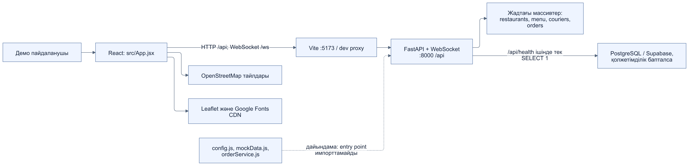
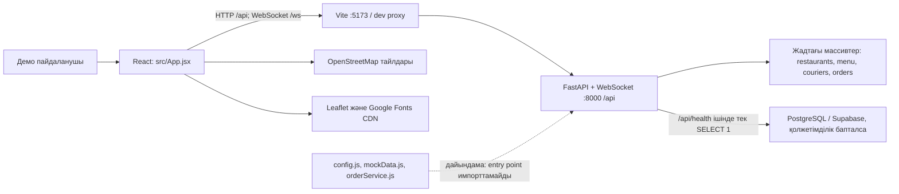
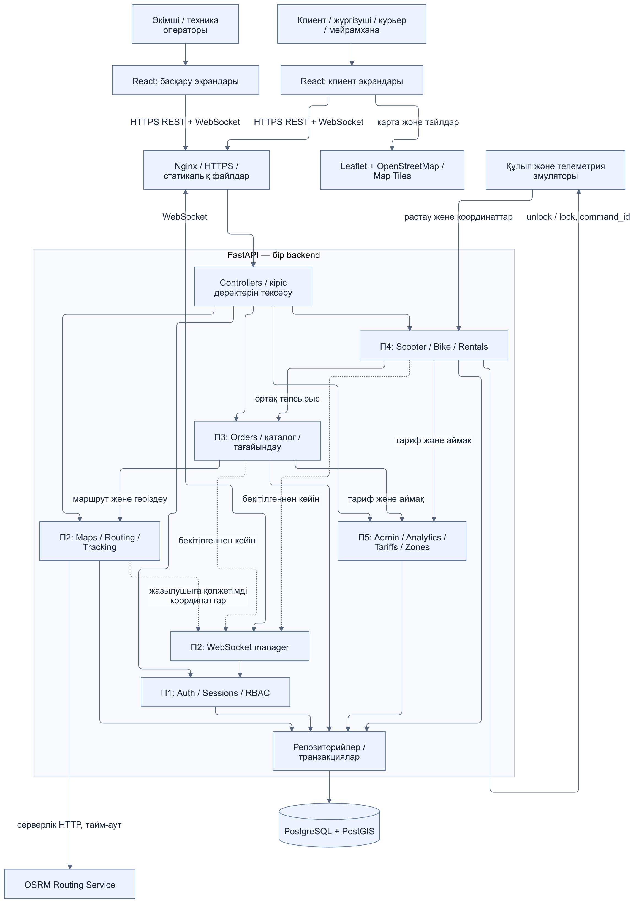
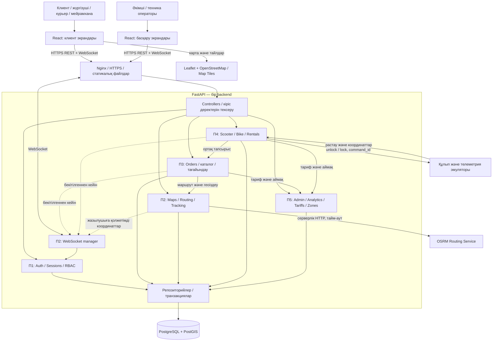
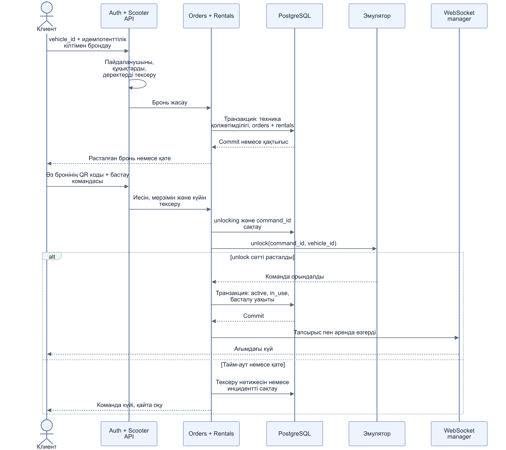
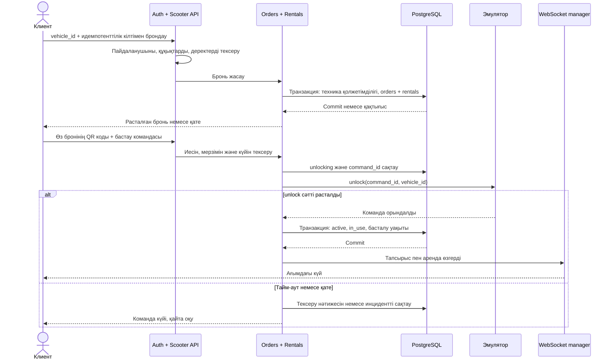

# YaGo жалпы архитектурасы

[Аптаның барлық материалдары](../../README.md) · [Орысша](../ru/02-system-architecture.md)

**Версия:** 1.0, 24.09.2026. **Жауапты:** П2 — Maps & Real-time.

## 1. Қазіргі архитектура

Қазіргі демонстрациялық жүйеде React Vite арқылы FastAPI және WebSocket серверіне қосылады. Бизнес деректері жадтағы массивтерде, карта Leaflet/OpenStreetMap арқылы беріледі. [SVG нұсқасы](diagrams/architecture-current.svg).

### Ағымдағы схеманы оқу

Пайдаланушы React экранымен жұмыс істейді, Vite `/api` REST сұрауларын және `/ws` WebSocket байланысын backend-ке өткізеді. Backend тапсырыстарды, мейрамханаларды және орындаушыларды уақытша жадта ұстайды, сондықтан қайта іске қосылғанда өзгерістер жоғалады. PostgreSQL бұл кезеңде тек қолжетімділік тексерісіне арналған, браузер оған тікелей қосылмайды.

```mermaid
flowchart LR
    User["Демо пайдаланушы"] --> UI["React: src/App.jsx"]
    UI -->|"HTTP /api; WebSocket /ws"| Vite["Vite :5173 / dev proxy"]
    Vite --> API["FastAPI + WebSocket :8000 /api"]
    API --> Memory["Жадтағы массивтер: restaurants, menu, couriers, orders"]
    API -->|"/api/health ішінде тек SELECT 1"| PG["PostgreSQL / Supabase, қолжетімділік бапталса"]
    UI --> Tiles["OpenStreetMap тайлдары"]
    UI --> CDN["Leaflet және Google Fonts CDN"]
    Drafts["config.js, mockData.js, orderService.js"] -.->|"дайындама: entry point импорттамайды"| API
```

## 2. Мақсатты архитектура

Мақсатты шешім — бір FastAPI backend-процесі бар модульдік монолит. Auth, Orders, Maps, Rentals және Admin модульдері ортақ PostgreSQL/PostGIS қоймасымен транзакциялар арқылы жұмыс істейді; Nginx REST пен WebSocket трафигін қабылдайды. [SVG нұсқасы](diagrams/architecture-target.svg).

### Мақсатты схеманы оқу

React әрекетті REST арқылы жібереді, ал өзгерістерді WebSocket алады. Auth құқықтарды тексереді; Orders ортақ тапсырысты, Rentals аренда күйін, Maps OSRM мен координаттарды, Admin тарифтер мен аймақтарды басқарады. Барлық модульдер Storage арқылы PostgreSQL/PostGIS-ке жазады. Commit-тен кейін WebSocket manager оқиғаны тек рұқсаты бар жазылушыларға таратады.

```mermaid
flowchart TB
    Client["Клиент / жүргізуші / курьер / мейрамхана"] --> Web["React: клиент экрандары"]
    Staff["Әкімші / техника операторы"] --> AdminUI["React: басқару экрандары"]
    Web -->|"HTTPS REST + WebSocket"| Edge["Nginx / HTTPS / статикалық файлдар"]
    AdminUI -->|"HTTPS REST + WebSocket"| Edge
    Web -->|"карта және тайлдар"| MapTiles["Leaflet + OpenStreetMap / Map Tiles"]
    subgraph Backend["FastAPI — бір backend"]
        API["Controllers / кіріс деректерін тексеру"]
        Auth["П1: Auth / Sessions / RBAC"]
        Orders["П3: Orders / каталог / тағайындау"]
        Maps["П2: Maps / Routing / Tracking"]
        Rentals["П4: Scooter / Bike / Rentals"]
        Admin["П5: Admin / Analytics / Tariffs / Zones"]
        RT["П2: WebSocket manager"]
        Storage["Репозиторийлер / транзакциялар"]
    end
    Edge --> API
    Edge <-->|"WebSocket"| RT
    API --> Auth
    RT --> Auth
    API --> Orders
    API --> Maps
    API --> Rentals
    API --> Admin
    Orders -->|"маршрут және геоіздеу"| Maps
    Rentals -->|"ортақ тапсырыс"| Orders
    Orders -->|"тариф және аймақ"| Admin
    Rentals -->|"тариф және аймақ"| Admin
    Maps -->|"серверлік HTTP, тайм-аут"| Routing["OSRM Routing Service"]
    Rentals -->|"unlock / lock, command_id"| Emulator["Құлып және телеметрия эмуляторы"]
    Emulator -->|"растау және координаттар"| Rentals
    Auth --> Storage
    Orders --> Storage
    Maps --> Storage
    Rentals --> Storage
    Admin --> Storage
    Storage --> DB[("PostgreSQL + PostGIS")]
    Orders -.->|"бекітілгеннен кейін"| RT
    Rentals -.->|"бекітілгеннен кейін"| RT
    Maps -.->|"жазылушыға қолжетімді координаттар"| RT
```

## 3. Апта 2 шешімдері

Node/Express прототипінен FastAPI-ге көшу келесі аптада орындалады; native WebSocket Socket.IO-дың орнын басады. Leaflet/OpenStreetMap карта қабаты ретінде сақталады, ал жол маршруты OSRM адаптері арқылы алынады. `orders` ортақ тапсырысты, `rentals` аренда деталін сақтайды. REST әрекетті бекітеді, WebSocket commit-тен кейін өзгерісті хабарлайды. Баға серверде есептеледі, браузер дерекқорға тікелей қосылмайды.

2GIS Routing API міндетті емес. OSRM-ның demo-сервері шектеулі болғандықтан, стенд үшін жеке OSRM немесе GraphHopper/OpenRouteService қолдану керек. Провайдер қолжетімсіз болса, API `routing_unavailable` қайтарады; түзу сызық тек көрнекі fallback ретінде қолданылады және ETA/баға есептеуіне кірмейді.

## 4. Аренда ағыны

Бронь транзакцияда жасалады, ал құлып эмуляторын күту кезінде дерекқор транзакциясы ашық тұрмайды. [SVG нұсқасы](diagrams/rental-sequence.svg).

### Аренда sequence диаграммасын оқу

Клиент `vehicle_id` және идемпотенттілік кілтімен бронь сұрайды. Backend пайдаланушыны, техниканы және құқықтарды тексеріп, `orders` пен `rentals` жазбаларын бір транзакцияда жасайды. QR іске қосылғанда сервер `unlocking` күйін сақтап, эмуляторға `unlock(command_id, vehicle_id)` жібереді. Расталған ашудан кейін аренда `active`, техника `in_use` болады және WebSocket manager клиентке жаңа күйді жібереді. Тайм-аут автоматты түрде отказ емес: құлып күйін қайта тексеру керек.

```mermaid
sequenceDiagram
    actor C as Клиент
    participant API as Auth + Scooter API
    participant O as Orders + Rentals
    participant DB as PostgreSQL
    participant E as Эмулятор
    participant G as WebSocket manager
    C->>API: vehicle_id + идемпотенттілік кілтімен брондау
    API->>API: Пайдаланушыны, құқықтарды, деректерді тексеру
    API->>O: Бронь жасау
    O->>DB: Транзакция: техника қолжетімділігі, orders + rentals
    DB-->>O: Commit немесе қақтығыс
    O-->>C: Расталған бронь немесе қате
    C->>API: Өз бронінің QR коды + бастау командасы
    API->>O: Иесін, мерзімін және күйін тексеру
    O->>DB: unlocking және command_id сақтау
    O->>E: unlock(command_id, vehicle_id)
    alt unlock сәтті расталды
        E-->>O: Команда орындалды
        O->>DB: Транзакция: active, in_use, басталу уақыты
        DB-->>O: Commit
        O->>G: Тапсырыс пен аренда өзгерді
        G-->>C: Ағымдағы күй
    else Тайм-аут немесе қате
        O->>DB: Тексеру нәтижесін немесе инцидентті сақтау
        O-->>C: Команда күйі, қайта оқу
    end
```

## 5. Тапсыру нәтижесі

Осы құжат T3/2-апта архитектуралық тапсырмасының казахша нұсқасы болып табылады: қазіргі және мақсатты схемалар, модуль иелері, REST/WebSocket протоколдары, сақтау орны және аренда ағыны көрсетілген. FastAPI, PostgreSQL/PostGIS, OSRM және IoT эмуляторының толық іске асуы келесі апталардың жұмысы.
