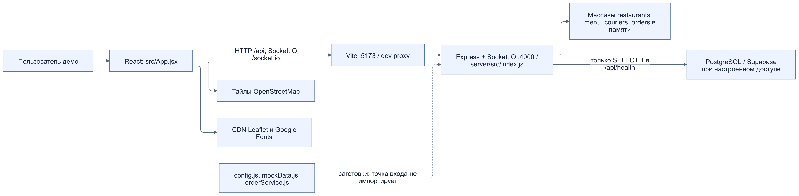
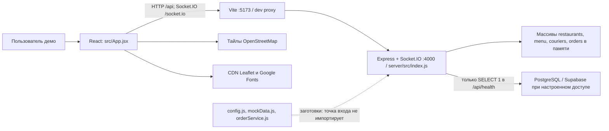
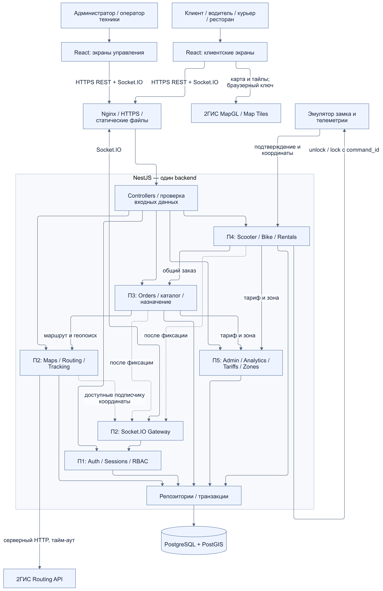
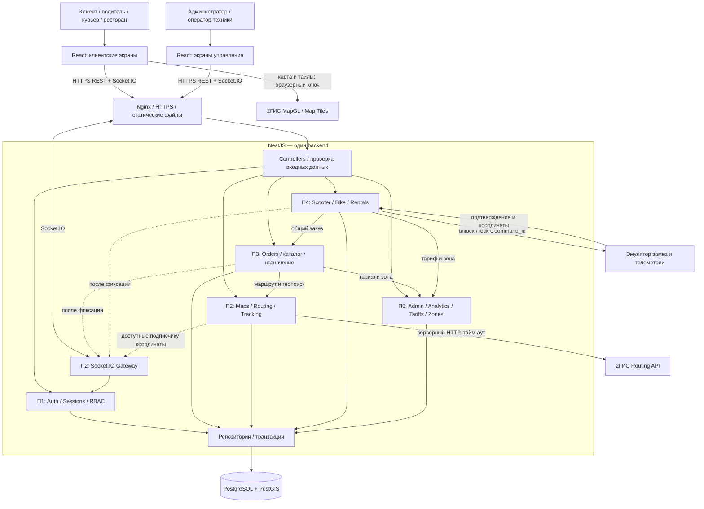
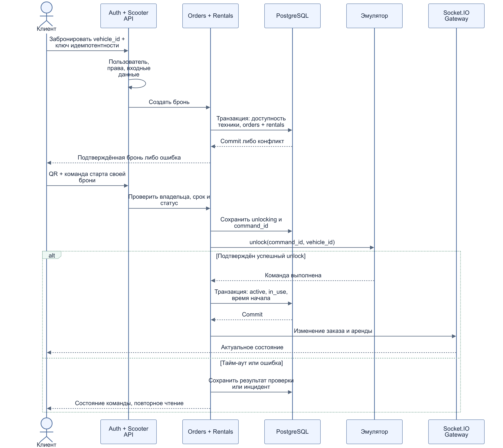
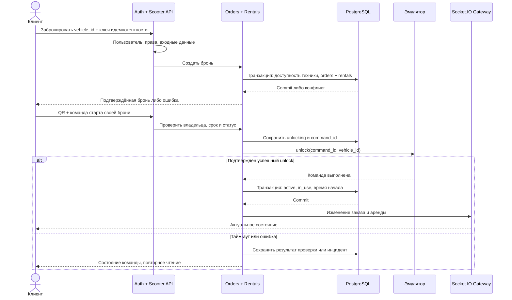

# П2. Общая архитектура YaGo

[Все материалы недели](../../README.md) · [Қазақша](../kk/02-system-architecture.md)

Версия 1.0, 24.09.2026. Результат недели 2: компоненты, связи, ответственность команды и решения для следующих недель. Фактическое устройство подтверждено [обзором исходников](../../common/ru/00-project-review.md); модель данных определена в [П3](../../p3/ru/03-database-entities.md) и [П5](../../p5/ru/05-er-model.md).

## 1. Текущая схема

*Текущая архитектура демонстрационного приложения в режиме разработки.* [Открыть SVG для увеличения](diagrams/architecture-current.svg).

Исходник Mermaid

Диаграмма относится к режиму разработки. Сейчас нет NestJS, MapGL, PostGIS-запросов, авторизации, аренды и постоянного хранения бизнес-данных. Соединения из браузера с PostgreSQL нет.

## 2. Целевая схема по ТЗ

Выбран модульный монолит: один backend-процесс, одна PostgreSQL, логически отдельные модули. Для команды из пяти человек и срока 13 недель это позволяет разделить ответственность, сохранив общие транзакции заказов и аренды. Микросервисы, отдельный брокер и несколько хранилищ в исходный объём не входят. Это проектное решение команды, а не свойство текущего кода.

*Целевая архитектура по ТЗ: компоненты, взаимодействия и ответственность модулей.* [Открыть SVG для увеличения](diagrams/architecture-target.svg).

Исходник Mermaid

Стрелки внутри backend означают вызов публичного сервиса модуля, а не отдельный сетевой сервис. Взаимодействие с Auth для защищённых HTTP-маршрутов выполняется до вызова бизнес-логики; для Socket.IO проверяются соединение и каждая подписка. Nginx и эмулятор на схеме — будущие компоненты. Браузер получает собранный React от Nginx; прямые обращения к 2ГИС относятся к внешней подложке карты, а бизнес-данные и серверный Routing идут через API.

## 3. Контракты между участниками

| Компонент / владелец | Ответственность | Вход → выход / зависимость |
|---|---|---|
| Auth, П1 | Регистрация, вход, сессии, JWT, затем OTP и роли | Учётные данные → подтверждённый `user_id` и набор ролей; владельцы ресурсов проверяются в соответствующем модуле |
| Maps и real-time, П2 | Адаптер карты, Routing, координаты, подписки | Координаты/тип услуги → геометрия, расстояние, ETA; событие с версией → доступные клиенту обновления |
| Orders, П3 | Единый заказ, каталог/позиции еды, назначение исполнителя, итог стоимости | `user_id`, тип, точки/корзина → сохранённый заказ; тариф получает из Admin, пространственный поиск из Maps |
| Scooter/Bike, П4 | Парк, бронь, аренда, переходы статусов, команды эмулятора | `vehicle_id`, команда клиента → `rentals` + связанный `orders`; вызывает сервис Orders в общей транзакции |
| Admin и Analytics, П5 | Управление тарифами/геозонами, показатели; проектирование общей БД | Проверенные права + изменение → версия тарифа/зоны; завершённые заказы → агрегаты |
| PostgreSQL/PostGIS, П5 совместно с владельцами модулей | Постоянное хранение, связи, уникальность, пространственные запросы | Репозитории backend → сущности [ER-модели](../../p5/ru/05-er-model.md); браузер к БД не подключается |

Роли `client`, `driver`, `courier`, `restaurant`, `admin` сохраняются как бизнес-словарь исходника. Для обслуживания парка проектируется `scooter_operator`: доступ к технике и инцидентам, но не к глобальным тарифам и чужим учётным данным. Наличие роли в интерфейсе не заменяет проверку на сервере.

Будущие модули NestJS экспортируют сервисы и скрывают внутренние репозитории; такой механизм предусмотрен системой `imports`/`exports` NestJS. Выбор границ выше — решение YaGo. [Официальная документация NestJS](https://docs.nestjs.com/modules).

## 4. Общие архитектурные решения

| Решение | Обоснование и последствия |
|---|---|
| Express → NestJS в неделю 3 | Выполняет выбранный в ТЗ стек; сначала перенести реальные обработчики из `index.js` и убрать дублирование данных. На переходе сохранить существующие URL и события, менять контракты согласованно с frontend |
| Leaflet/OSM → 2ГИС MapGL в неделю 4 | Выполняет ТЗ; выделить адаптер отображения карты, чтобы бизнес-формы не зависели от библиотеки. Пока переход не выполнен, Leaflet остаётся явным режимом демо |
| Routing отдельно от отрисовки в неделю 5 | Прямой отрезок текущего UI нельзя использовать для расчёта дорожного расстояния и ETA. Сервер возвращает результат маршрутизации либо явное состояние недоступности |
| PostgreSQL + PostGIS в неделю 4 | Заказы и аренды должны переживать рестарт; геопоиск исполнителей и проверка зон используют одно хранилище. Текущее подключение Supabase — заготовка; целевое размещение PostgreSQL на Ubuntu соответствует ТЗ |
| Единый `orders.type` | `taxi`, `delivery`, `scooter`, `bike`; прежний `food` переводится в `delivery` + `delivery_kind=food`. Специфика аренды хранится в `rentals` один-к-одному с заказом |
| Сервер — источник цены и времени | Пользователь передаёт намерение; сервер рассчитывает сумму по сохранённому снимку тарифа. Деньги — целые минимальные единицы KZT, время — UTC; UI форматирует в Asia/Almaty |
| REST фиксирует действие, Socket.IO сообщает изменение | Изменение публикуется после commit; HTTP-ответ и событие применяются к одной записи по ID. Двойное получение не создаёт второй заказ |
| Эмулятор вместо реального замка в учебном MVP | QR обозначает технику, но не предоставляет право открыть её; подтверждение команды приходит через серверный адаптер. Коммерческая IoT-интеграция вне 13-недельного объёма |
| Расчёт стоимости без эквайринга | В ТЗ нет реализации платёжного провайдера. Завершённый заказ и рассчитанная сумма не доказывают получение денег; денежные операции не объявляются готовыми |

MapGL предоставляет отрисовку карты в браузере; доступ к картографическим API требует ключа. Доступность, ограничения ключа и стоимость выбранного пакета проверяются при интеграции, числовые лимиты не зафиксированы как постоянные. [2ГИС: MapGL](https://docs.2gis.com/en/mapgl/overview/features), [доступ к картам](https://docs.2gis.com/en/maps/overview).

Routing API предоставляет геометрию, расстояние и время маршрута для поддерживаемых способов передвижения. В YaGo результат следует получать через серверный адаптер с тайм-аутом, а недоступность отображать в UI. [2ГИС Routing API](https://docs.2gis.com/en/api/navigation/routing/overview).

Для поиска в радиусе планируется `ST_DWithin` по географическим координатам: у варианта `geography` расстояние задаётся в метрах. Выбор индексов и конкретного KNN-запроса относится к неделе 6. [PostGIS ST_DWithin](https://postgis.net/docs/ST_DWithin.html).

## 5. Потоки данных

### Такси и доставка

1. Клиент получает доступные услуги, рестораны, тарифное предложение и карту.
2. Auth подтверждает пользователя. Orders проверяет точки и тип; для еды — ресторан, позиции и количества. Доверенная сумма рассчитывается на сервере.
3. Orders сохраняет заказ и снимок тарифа; подбор исполнителя учитывает роль, доступность и расстояние. Назначение должно исключать одновременное резервирование одного исполнителя двумя заказами.
4. После фиксации изменения Gateway отправляет его клиенту и назначенному исполнителю в разрешённые комнаты. Ресторан видит только свои заказы еды.
5. Авторизованный исполнитель передаёт координаты; Maps проверяет координаты и метку времени, сохраняет актуальную позицию, передаёт её подписчикам.
6. Завершение фиксирует итог заказа. История и аналитика читают сохранённые данные; оборот заказов и доход платформы считаются отдельно.

### Самокат и велосипед

*Взаимодействие клиента, API, БД, эмулятора и Socket.IO при бронировании и запуске аренды.* [Открыть SVG для увеличения](diagrams/rental-sequence.svg).

Исходник Mermaid

Транзакция БД не удерживается во время ожидания замка. Неопределённый результат команды требует сверки; повтор с тем же ключом не запускает вторую аренду. Завершение, запрет парковки, отказ связи и прекращение начисления определены в [спецификации П4](../../p4/ru/04-scooter-specification.md).

### События и восстановление

В переходной реализации сохраняются `orderCreated`, `orderStatusUpdated`, `driverMoved`; формат будущих событий должен включать ID сущности, версию и серверное время. Добавление событий аренды согласуется П2/П4. Комнаты привязаны к подтверждённому пользователю/заказу, произвольный `joinRoom` заменяется проверенной подпиской.

Socket.IO по умолчанию не обеспечивает повторную доставку всех пропущенных серверных сообщений. Поэтому в YaGo после переподключения клиент повторно читает REST-состояние, объединяет записи по ID и игнорирует устаревшие версии. Если событие потерялось между commit и публикацией, чтение из БД восстанавливает состояние; абсолютная гарантия доставки в этой архитектурной версии не заявляется. [Socket.IO: гарантии доставки](https://socket.io/docs/v4/delivery-guarantees/).

## 6. Размещение и границы доступа

| Среда | Компоненты | Конфигурация |
|---|---|---|
| Сейчас, разработка | Vite `:5173`, Express `:4000`, массивы в памяти; необязательная проверка внешней PostgreSQL | `PORT` и `DATABASE_URL` читает точка входа; CITY пока не подключён; proxy жёстко использует 4000 |
| Целевая разработка | React, NestJS, тестовая PostgreSQL/PostGIS и эмулятор | Отдельные тестовые данные; серверные секреты только в backend окружении, браузеру — разрешённая публичная конфигурация |
| Целевой стенд, неделя 11 | Ubuntu, Nginx, frontend dist, Node.js, PostgreSQL/PostGIS | HTTPS, proxy `/api` и `/socket.io`, сервер БД не доступен браузеру; резервное копирование и проверка восстановления перед показом |

Администратор и оператор используют общий backend с разграничением прав. При недоступной БД целевая система не подтверждает новое действие и не подменяет постоянное хранилище массивом. При недоступной карте список заказов остаётся доступен; при недоступном Routing нельзя выдавать прямую линию за рассчитанный маршрут. Потеря телеметрии и ошибки замка обрабатываются по П4.

Планируемые конфигурационные группы: подключение БД, Auth/JWT/OTP, браузерный ключ карты, серверный ключ Routing, параметры эмулятора. Их точные имена и способ выдачи задаются при реализации модулей. Опубликованный браузерный ключ не считается секретом; секреты БД, подписи токенов и серверных интеграций в frontend bundle не помещаются.

## 7. Передача на следующие недели и критерии готовности П2

| Неделя | Архитектурный результат для реализации |
|---|---|
| 3 | П1 создаёт NestJS-каркас и единый источник бизнес-логики; П2–П5 используют эту схему для IDEF/DFD и уточнения модели |
| 4 | Auth-таблицы, единые orders, PostgreSQL/PostGIS, миграции и MapGL |
| 5–6 | Регистрация, Routing, vehicles CRUD, назначение, проверяемые подписки, QR-эмуляция и парковочные зоны |
| 7–8 | Сквозные сценарии, UI аренды, CRUD тарифов/зон, скидки и версия расчёта |
| 9–11 | Аналитика, resync, проверки безопасности/нагрузки, затем стенд с HTTPS |

Критерии недели 2: показаны текущая и целевая схемы; у каждого компонента есть владелец; отмечены протоколы и хранилище; объяснены переходы Express/NestJS и Leaflet/2ГИС; согласованы типы заказов, границы аренды, источник цены и политика восстановления. Эти решения подготовлены настоящим документом. Показатели производительности и нагрузочные пороги предстоит согласовать до испытаний недели 10; они не выдаются за измеренные свойства прототипа.
