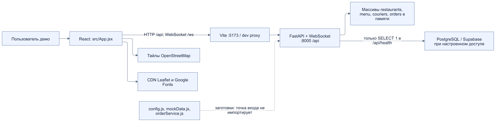
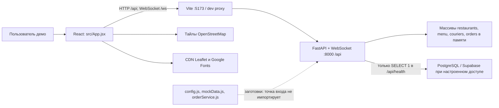
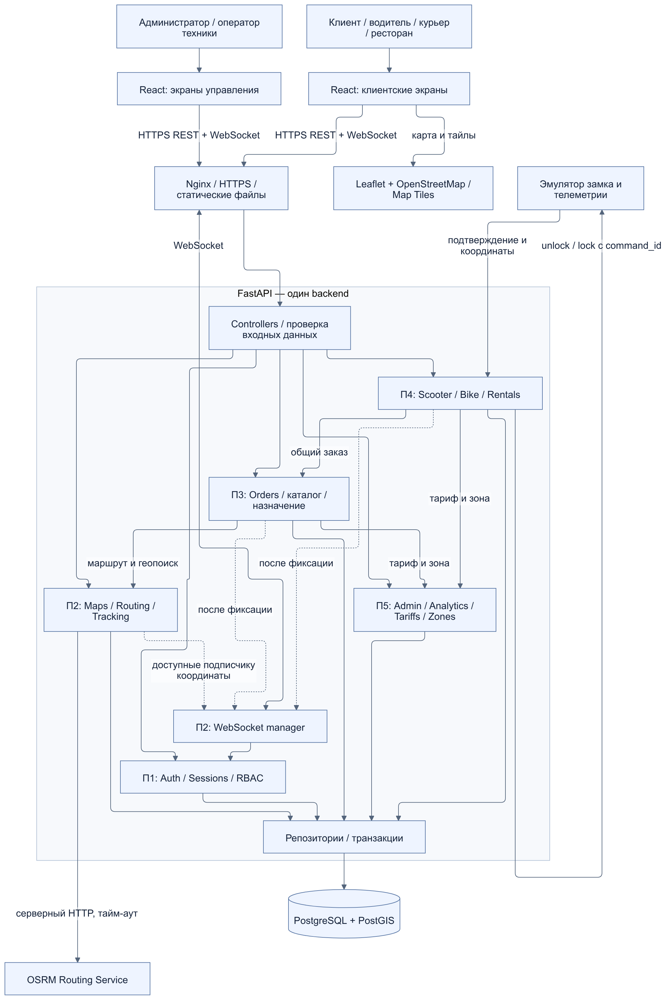
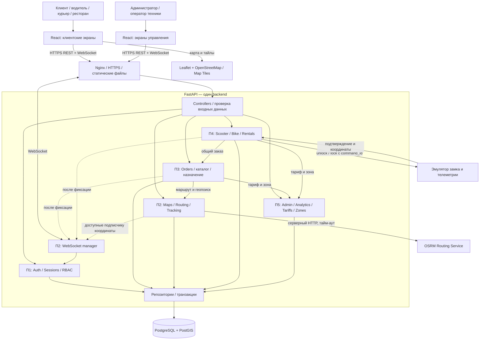
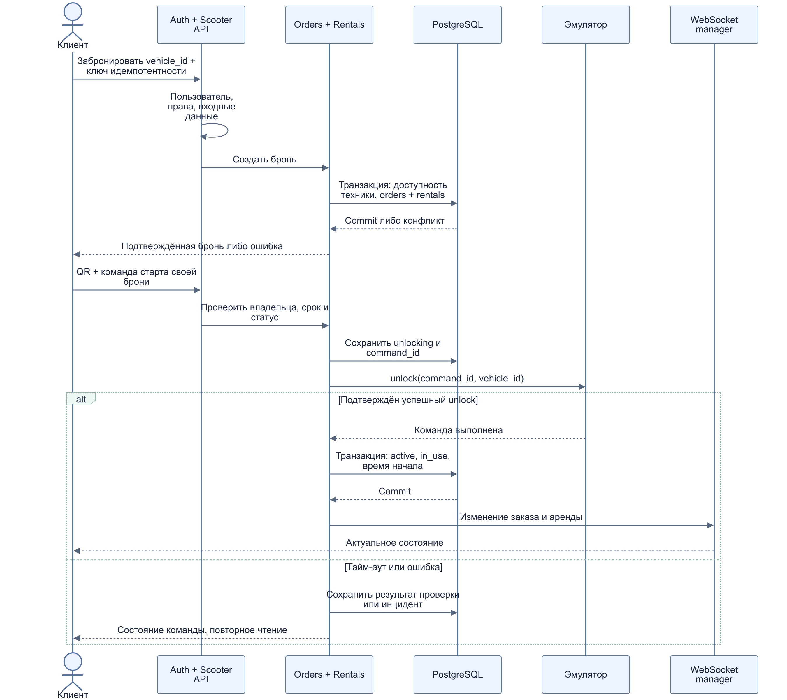
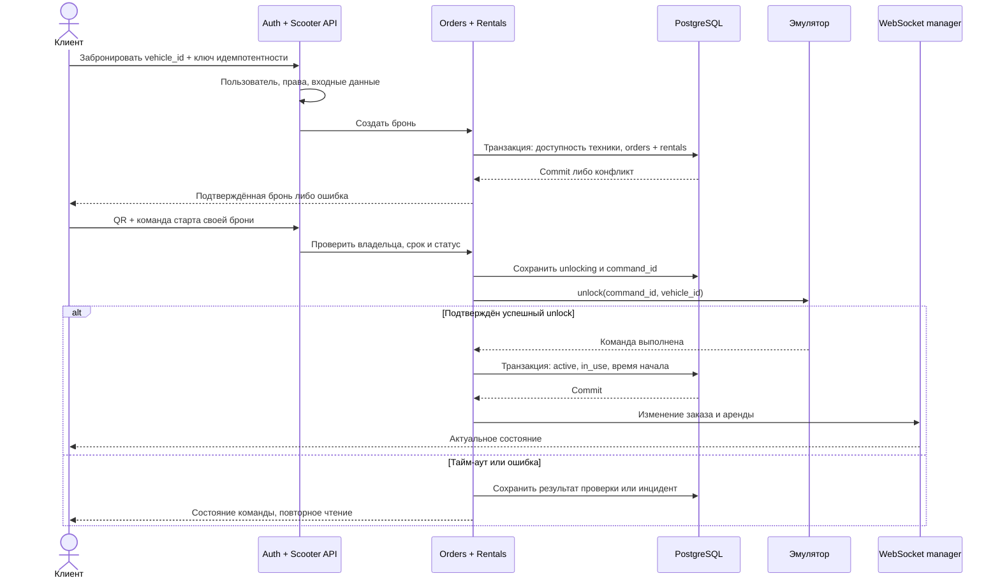

# П2. Общая архитектура YaGo

[Все материалы недели](../../README.md) · [Қазақша](../kk/02-system-architecture.md)

Версия 1.0, 24.09.2026. Результат недели 2: компоненты, связи, ответственность команды и решения для следующих недель. Фактическое устройство подтверждено [обзором исходников](../../common/ru/00-project-review.md); модель данных определена в [П3](../../p3/ru/03-database-entities.md) и [П5](../../p5/ru/05-er-model.md).

## 1. Текущая схема

*Текущая архитектура демонстрационного приложения в режиме разработки.* [Открыть SVG для увеличения](diagrams/architecture-current.svg).

Исходник Mermaid

```mermaid
flowchart LR
    User["Пользователь демо"] --> UI["React: src/App.jsx"]
    UI -->|"HTTP /api; WebSocket /ws"| Vite["Vite :5173 / dev proxy"]
    Vite --> API["FastAPI + WebSocket :8000 /api"]
    API --> Memory["Массивы restaurants, menu, couriers, orders в памяти"]
    API -->|"только SELECT 1 в /api/health"| PG["PostgreSQL / Supabase при настроенном доступе"]
    UI --> Tiles["Тайлы OpenStreetMap"]
    UI --> CDN["CDN Leaflet и Google Fonts"]
    Drafts["config.js, mockData.js, orderService.js"] -.->|"заготовки: точка входа не импортирует"| API
```

Диаграмма относится к согласованному документному стеку разработки. Исходный Node-прототип пока не мигрирован в FastAPI; миграция backend выполняется отдельной задачей. В текущем сценарии нет авторизации, аренды, PostGIS-запросов и постоянного хранения бизнес-данных. Браузер не подключается к PostgreSQL напрямую.

### Как читать текущую схему

1. Пользователь работает с React-интерфейсом, который запускается через Vite на `:5173`.
2. REST-запросы к `/api` и WebSocket-соединение `/ws` проходят через dev proxy к backend на `:8000`.
3. Backend временно использует массивы заказов, ресторанов и исполнителей. Поэтому перезапуск процесса удаляет изменения.
4. PostgreSQL на этой схеме нужен только для проверки доступности; бизнес-записи ещё не сохраняются.
5. Leaflet отображает тайлы OpenStreetMap. Отображение карты и расчёт дорожного маршрута являются разными задачами.

## 2. Целевая схема по ТЗ

Выбран модульный монолит: один backend-процесс, одна PostgreSQL, логически отдельные модули. Для команды из пяти человек и срока 13 недель это позволяет разделить ответственность, сохранив общие транзакции заказов и аренды. Микросервисы, отдельный брокер и несколько хранилищ в исходный объём не входят. Это проектное решение команды, а не свойство текущего кода.

*Целевая архитектура по ТЗ: компоненты, взаимодействия и ответственность модулей.* [Открыть SVG для увеличения](diagrams/architecture-target.svg).

Исходник Mermaid

```mermaid
flowchart TB
    Client["Клиент / водитель / курьер / ресторан"] --> Web["React: клиентские экраны"]
    Staff["Администратор / оператор техники"] --> AdminUI["React: экраны управления"]
    Web -->|"HTTPS REST + WebSocket"| Edge["Nginx / HTTPS / статические файлы"]
    AdminUI -->|"HTTPS REST + WebSocket"| Edge
    Web -->|"карта и тайлы"| MapTiles["Leaflet + OpenStreetMap / Map Tiles"]

    subgraph Backend["FastAPI — один backend"]
        API["Controllers / проверка входных данных"]
        Auth["П1: Auth / Sessions / RBAC"]
        Orders["П3: Orders / каталог / назначение"]
        Maps["П2: Maps / Routing / Tracking"]
        Rentals["П4: Scooter / Bike / Rentals"]
        Admin["П5: Admin / Analytics / Tariffs / Zones"]
        RT["П2: WebSocket manager"]
        Storage["Репозитории / транзакции"]
    end

    Edge --> API
    Edge <-->|"WebSocket"| RT
    API --> Auth
    RT --> Auth
    API --> Orders
    API --> Maps
    API --> Rentals
    API --> Admin
    Orders -->|"маршрут и геопоиск"| Maps
    Rentals -->|"общий заказ"| Orders
    Orders -->|"тариф и зона"| Admin
    Rentals -->|"тариф и зона"| Admin
    Maps -->|"серверный HTTP, тайм-аут"| Routing["OSRM Routing Service"]
    Rentals -->|"unlock / lock с command_id"| Emulator["Эмулятор замка и телеметрии"]
    Emulator -->|"подтверждение и координаты"| Rentals
    Auth --> Storage
    Orders --> Storage
    Maps --> Storage
    Rentals --> Storage
    Admin --> Storage
    Storage --> DB[("PostgreSQL + PostGIS")]
    Orders -.->|"после фиксации"| RT
    Rentals -.->|"после фиксации"| RT
    Maps -.->|"доступные подписчику координаты"| RT
```

Стрелки внутри backend означают вызов публичного сервиса модуля, а не отдельный сетевой сервис. Взаимодействие с Auth для защищённых HTTP-маршрутов выполняется до вызова бизнес-логики; для WebSocket проверяются соединение и каждая подписка. Nginx и эмулятор на схеме — будущие компоненты. Браузер получает собранный React от Nginx; карта загружает тайлы OpenStreetMap, а бизнес-данные и серверный Routing идут через API.

### Как читать целевую схему

1. Клиентские и административные React-экраны отправляют действия через HTTPS REST, а изменения получают через WebSocket.
2. Nginx принимает внешний трафик и передаёт его в один процесс FastAPI. Модули внутри него не являются отдельными микросервисами.
3. Auth проверяет пользователя и роль до вызова Orders, Maps, Rentals или Admin.
4. Orders отвечает за общий заказ, Rentals — за аренду, Maps — за координаты и OSRM, Admin — за тарифы и зоны.
5. Все модули сохраняют данные через Storage в PostgreSQL/PostGIS. Браузер не имеет прямого доступа к базе.
6. После commit Orders, Rentals и Maps передают событие WebSocket manager, который отправляет его только проверенным подписчикам.

**REST выполняет действие, WebSocket сообщает об изменении, OSRM рассчитывает дорожный маршрут, PostgreSQL/PostGIS хранит состояние.** Это главный смысл целевой диаграммы.

### Что делать без 2GIS Routing API

2GIS Routing API не является обязательной частью YaGo. В качестве учебного провайдера маршрутов выбран **OSRM**: backend отправляет ему координаты через серверный HTTP-адаптер и получает геометрию, расстояние и длительность. Публичный demo-сервер OSRM имеет ограничения; для стенда следует использовать собственный экземпляр OSRM либо совместимый GraphHopper/OpenRouteService. Если провайдер недоступен, API возвращает `routing_unavailable`, а не выдаёт прямой отрезок за дорожный маршрут. Прямая линия допустима только как визуальный fallback без ETA и расчёта стоимости.

## 3. Контракты между участниками

| Компонент / владелец | Ответственность | Вход → выход / зависимость |
|---|---|---|
| Auth, П1 | Регистрация, вход, сессии, JWT, затем OTP и роли | Учётные данные → подтверждённый `user_id` и набор ролей; владельцы ресурсов проверяются в соответствующем модуле |
| Maps и real-time, П2 | Адаптер карты, Routing, координаты, подписки | Координаты/тип услуги → геометрия, расстояние, ETA; событие с версией → доступные клиенту обновления |
| Orders, П3 | Единый заказ, каталог/позиции еды, назначение исполнителя, итог стоимости | `user_id`, тип, точки/корзина → сохранённый заказ; тариф получает из Admin, пространственный поиск из Maps |
| Scooter/Bike, П4 | Парк, бронь, аренда, переходы статусов, команды эмулятора | `vehicle_id`, команда клиента → `rentals` + связанный `orders`; вызывает сервис Orders в общей транзакции |
| Admin и Analytics, П5 | Управление тарифами/геозонами, показатели; проектирование общей БД | Проверенные права + изменение → версия тарифа/зоны; завершённые заказы → агрегаты |
| PostgreSQL/PostGIS, П5 совместно с владельцами модулей | Постоянное хранение, связи, уникальность, пространственные запросы | Репозитории backend → сущности [ER-модели](../../p5/ru/05-er-model.md); браузер к БД не подключается |

Роли `client`, `driver`, `courier`, `restaurant`, `admin` сохраняются как бизнес-словарь исходника. Для обслуживания парка проектируется `scooter_operator`: доступ к технике и инцидентам, но не к глобальным тарифам и чужим учётным данным. Наличие роли в интерфейсе не заменяет проверку на сервере.

Будущие модули FastAPI экспортируют сервисы через обычные Python-зависимости и скрывают внутренние репозитории; маршруты FastAPI не должны обращаться к базе напрямую. Выбор границ выше — решение YaGo. [FastAPI: зависимости](https://fastapi.tiangolo.com/tutorial/dependencies/).

## 4. Общие архитектурные решения

| Решение | Обоснование и последствия |
|---|---|
| Node/Express-прототип → FastAPI в неделю 3 | Фиксирует выбранный backend-стек; перенести REST-контракты, вынести бизнес-логику в сервисы и заменить Socket.IO на native WebSocket. На переходе сохранить URL и форматы событий |
| Leaflet/OpenStreetMap сохраняется | Карта не зависит от сервиса дорожной маршрутизации; UI использует Leaflet для отображения, а backend получает маршруты через OSRM-адаптер |
| Routing отдельно от отрисовки в неделю 5 | Прямой отрезок текущего UI нельзя использовать для расчёта дорожного расстояния и ETA. Сервер возвращает результат маршрутизации либо явное состояние недоступности |
| PostgreSQL + PostGIS в неделю 4 | Заказы и аренды должны переживать рестарт; геопоиск исполнителей и проверка зон используют одно хранилище. Текущее подключение Supabase — заготовка; целевое размещение PostgreSQL на Ubuntu соответствует ТЗ |
| Единый `orders.type` | `taxi`, `delivery`, `scooter`, `bike`; прежний `food` переводится в `delivery` + `delivery_kind=food`. Специфика аренды хранится в `rentals` один-к-одному с заказом |
| Сервер — источник цены и времени | Пользователь передаёт намерение; сервер рассчитывает сумму по сохранённому снимку тарифа. Деньги — целые минимальные единицы KZT, время — UTC; UI форматирует в Asia/Almaty |
| REST фиксирует действие, WebSocket сообщает изменение | Изменение публикуется после commit; HTTP-ответ и событие применяются к одной записи по ID. Двойное получение не создаёт второй заказ |
| Эмулятор вместо реального замка в учебном MVP | QR обозначает технику, но не предоставляет право открыть её; подтверждение команды приходит через серверный адаптер. Коммерческая IoT-интеграция вне 13-недельного объёма |
| Расчёт стоимости без эквайринга | В ТЗ нет реализации платёжного провайдера. Завершённый заказ и рассчитанная сумма не доказывают получение денег; денежные операции не объявляются готовыми |

Leaflet отображает тайлы OpenStreetMap в браузере. Для учебного прототипа отдельный ключ карты не нужен, но публичные tile-сервисы имеют правила использования и ограничения нагрузки; для стенда их нужно соблюдать или развернуть собственный tile-сервис.

OSRM Routing Service предоставляет геометрию, расстояние и время маршрута для поддерживаемых способов передвижения. В YaGo результат следует получать через серверный адаптер с тайм-аутом, а недоступность отображать в UI. [OSRM API](https://project-osrm.org/docs/v5.24.0/api/).

Для поиска в радиусе планируется `ST_DWithin` по географическим координатам: у варианта `geography` расстояние задаётся в метрах. Выбор индексов и конкретного KNN-запроса относится к неделе 6. [PostGIS ST_DWithin](https://postgis.net/docs/ST_DWithin.html).

## 5. Потоки данных

### Такси и доставка

1. Клиент получает доступные услуги, рестораны, тарифное предложение и карту.
2. Auth подтверждает пользователя. Orders проверяет точки и тип; для еды — ресторан, позиции и количества. Доверенная сумма рассчитывается на сервере.
3. Orders сохраняет заказ и снимок тарифа; подбор исполнителя учитывает роль, доступность и расстояние. Назначение должно исключать одновременное резервирование одного исполнителя двумя заказами.
4. После фиксации WebSocket manager отправляет изменение клиенту и назначенному исполнителю в проверенные подписки. Ресторан видит только свои заказы еды.
5. Авторизованный исполнитель передаёт координаты; Maps проверяет координаты и метку времени, сохраняет актуальную позицию, передаёт её подписчикам.
6. Завершение фиксирует итог заказа. История и аналитика читают сохранённые данные; оборот заказов и доход платформы считаются отдельно.

### Самокат и велосипед

*Взаимодействие клиента, API, БД, эмулятора и WebSocket при бронировании и запуске аренды.* [Открыть SVG для увеличения](diagrams/rental-sequence.svg).

Исходник Mermaid

```mermaid
sequenceDiagram
    actor C as Клиент
    participant API as Auth + Scooter API
    participant O as Orders + Rentals
    participant DB as PostgreSQL
    participant E as Эмулятор
    participant G as WebSocket manager
    C->>API: Забронировать vehicle_id + ключ идемпотентности
    API->>API: Пользователь, права, входные данные
    API->>O: Создать бронь
    O->>DB: Транзакция: доступность техники, orders + rentals
    DB-->>O: Commit либо конфликт
    O-->>C: Подтверждённая бронь либо ошибка
    C->>API: QR + команда старта своей брони
    API->>O: Проверить владельца, срок и статус
    O->>DB: Сохранить unlocking и command_id
    O->>E: unlock(command_id, vehicle_id)
    alt Подтверждён успешный unlock
        E-->>O: Команда выполнена
        O->>DB: Транзакция: active, in_use, время начала
        DB-->>O: Commit
        O->>G: Изменение заказа и аренды
        G-->>C: Актуальное состояние
    else Тайм-аут или ошибка
        O->>DB: Сохранить результат проверки или инцидент
        O-->>C: Состояние команды, повторное чтение
    end
```

Транзакция БД не удерживается во время ожидания замка. Неопределённый результат команды требует сверки; повтор с тем же ключом не запускает вторую аренду. Завершение, запрет парковки, отказ связи и прекращение начисления определены в [спецификации П4](../../p4/ru/04-scooter-specification.md).

### Как читать sequence-диаграмму аренды

1. Клиент отправляет `vehicle_id` и ключ идемпотентности. Backend проверяет пользователя, права, технику и отсутствие другой активной аренды.
2. Orders/Rentals создаёт `orders` и `rentals` в транзакции. При конфликте база возвращает ошибку, и вторая бронь не появляется.
3. Для запуска клиент отправляет QR-код. Сервер проверяет, что QR относится к технике текущей брони, срок не истёк, а статус допускает запуск.
4. Аренда переходит в `unlocking`, после чего backend отправляет эмулятору `unlock(command_id, vehicle_id)`.
5. При подтверждённом открытии аренда становится `active`, техника — `in_use`, а WebSocket manager отправляет клиенту новое состояние.
6. При отказе или неизвестном результате сервер сохраняет инцидент. Тайм-аут не считается автоматическим отказом: состояние замка нужно сверить повторным чтением.

На диаграмме `DB` — PostgreSQL, `E` — учебный эмулятор замка, `G` — WebSocket manager. Пунктирные сообщения показывают ответы или события, а не отдельные постоянные сервисы.

### События и восстановление

В переходной реализации сохраняются `orderCreated`, `orderStatusUpdated`, `driverMoved`; формат будущих событий должен включать ID сущности, версию и серверное время. Добавление событий аренды согласуется П2/П4. WebSocket manager — это не Socket.IO Gateway, а слой FastAPI, который хранит активные соединения, проверяет подписки и рассылает события.

Native WebSocket по умолчанию не обеспечивает повторную доставку всех пропущенных серверных сообщений. Поэтому в YaGo после переподключения клиент повторно читает REST-состояние, объединяет записи по ID и игнорирует устаревшие версии. Если событие потерялось между commit и публикацией, чтение из БД восстанавливает состояние; абсолютная гарантия доставки в этой архитектурной версии не заявляется.

## 6. Размещение и границы доступа

| Среда | Компоненты | Конфигурация |
|---|---|---|
| Сейчас, разработка | Vite `:5173`, FastAPI `:8000`, массивы в памяти; необязательная проверка внешней PostgreSQL | Backend принимает `/api` и `/ws` на 8000; браузер не подключается к БД напрямую |
| Целевая разработка | React, FastAPI, тестовая PostgreSQL/PostGIS и эмулятор | Отдельные тестовые данные; серверные секреты только в backend окружении, браузеру — разрешённая публичная конфигурация |
| Целевой стенд, неделя 11 | Ubuntu, Nginx, frontend dist, FastAPI/Uvicorn, PostgreSQL/PostGIS | HTTPS, proxy `/api` и `/ws`, сервер БД не доступен браузеру; резервное копирование и проверка восстановления перед показом |

Администратор и оператор используют общий backend с разграничением прав. При недоступной БД целевая система не подтверждает новое действие и не подменяет постоянное хранилище массивом. При недоступной карте список заказов остаётся доступен; при недоступном Routing нельзя выдавать прямую линию за рассчитанный маршрут. Потеря телеметрии и ошибки замка обрабатываются по П4.

Планируемые конфигурационные группы: подключение БД, Auth/JWT/OTP, браузерный ключ карты, серверный ключ Routing, параметры эмулятора. Их точные имена и способ выдачи задаются при реализации модулей. Опубликованный браузерный ключ не считается секретом; секреты БД, подписи токенов и серверных интеграций в frontend bundle не помещаются.

## 7. Передача на следующие недели и критерии готовности П2

| Неделя | Архитектурный результат для реализации |
|---|---|
| 3 | П1 создаёт FastAPI-каркас и единый источник бизнес-логики; П2–П5 используют эту схему для IDEF/DFD и уточнения модели |
| 4 | Auth-таблицы, единые orders, PostgreSQL/PostGIS, миграции и Leaflet/OpenStreetMap |
| 5–6 | Регистрация, Routing, vehicles CRUD, назначение, проверяемые подписки, QR-эмуляция и парковочные зоны |
| 7–8 | Сквозные сценарии, UI аренды, CRUD тарифов/зон, скидки и версия расчёта |
| 9–11 | Аналитика, resync, проверки безопасности/нагрузки, затем стенд с HTTPS |

Критерии недели 2: показаны текущая и целевая схемы; у каждого компонента есть владелец; отмечены REST, WebSocket и хранилище; объяснены переход Node-прототипа к FastAPI и независимость Leaflet от Routing; согласованы типы заказов, границы аренды, источник цены и политика восстановления. Эти решения подготовлены настоящим документом. Показатели производительности и нагрузочные пороги предстоит согласовать до испытаний недели 10; они не выдаются за измеренные свойства прототипа.
