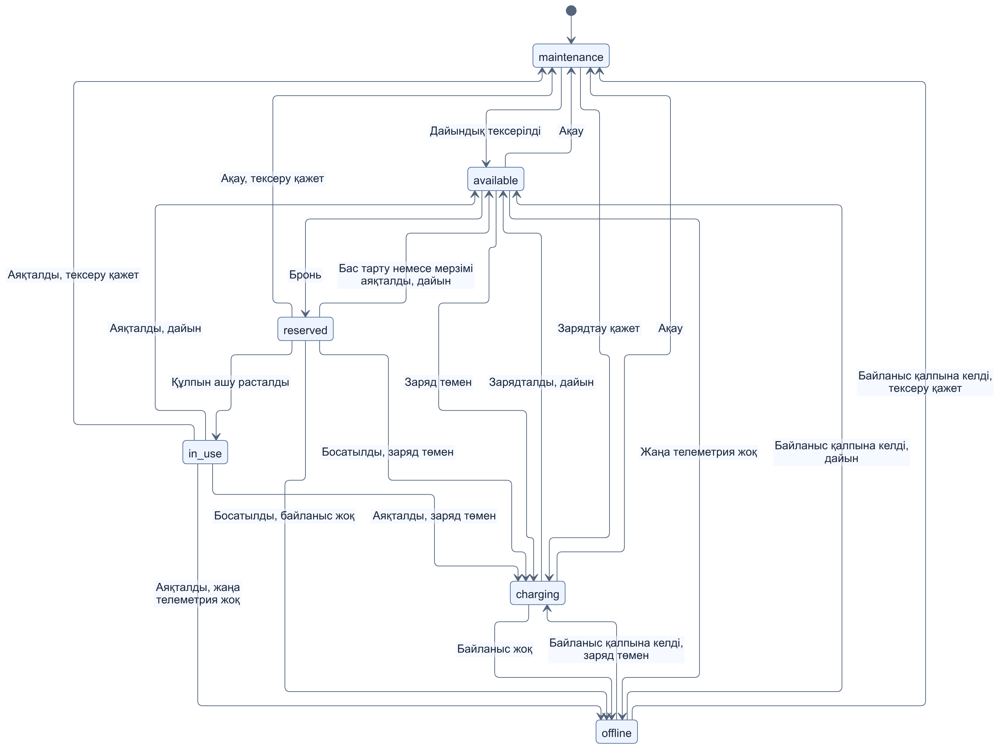
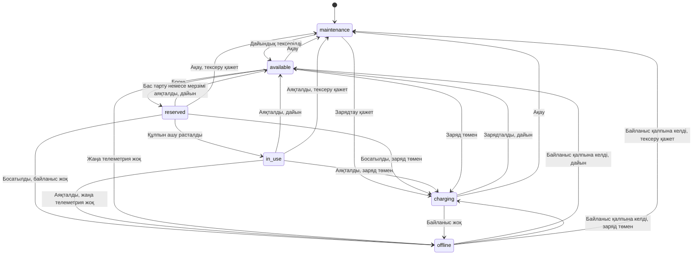
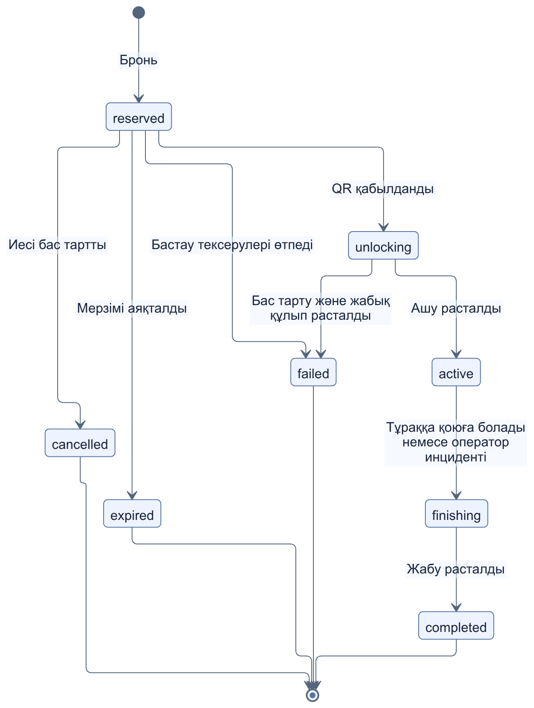
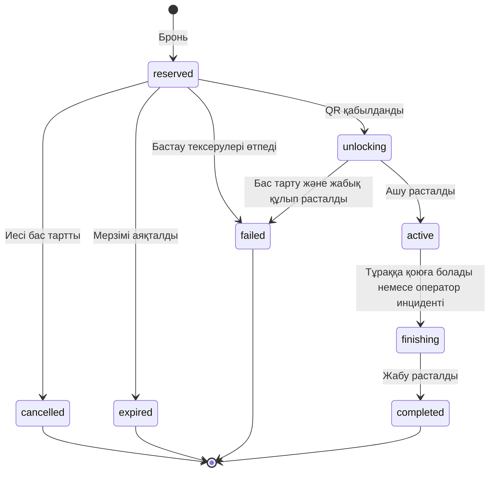

# Самокат пен велосипед модулінің спецификациясы

[Аптаның барлық материалдары](../../README.md) · [Орысша](../ru/04-scooter-specification.md)

**Кезең:** 2-апта. **Жауапты:** П4.

## 1. Мақсаты мен шекарасы

Клиент картадан бос техниканы табады, тарифті көреді, бронь жасайды, QR арқылы аренда бастайды және рұқсат етілген тұрақ аймағында аяқтайды. Сервер статустардың ауысуын және бағаны тексереді; оператор парк пен инциденттерді басқарады. Бұл оқу спецификациясы, қазіргі кодта аренда қоймасы немесе unlock API әлі жоқ.

## 2. Рөлдер және деректер

`client` өз арендасын брондайды және аяқтайды; `scooter_operator` техниканы тексереді; `admin` парк, тарифтер мен аймақтарды басқарады. `orders` ортақ тапсырысты, `rentals` аренда өмірлік циклін, `vehicles` техниканы, `tariffs` тариф нұсқасын және `zones` геоаймақтарды сақтайды. Бір клиентте немесе техникада бір уақытта бір ғана аяқталмаған аренда болады.

## 3. Техника күйлері

`available`, `reserved`, `in_use`, `maintenance`, `charging`, `offline` күйлері қолданылады. Велосипедке `charging` қолданылмайды. Байланыс жоғалса, техника автоматты түрде қолжетімді болып кетпейді. [SVG нұсқасы](diagrams/vehicle-states.svg).

## 4. Аренда өмірлік циклі

Қалыпты жол: `reserved → unlocking → active → finishing → completed`. Басталған арендада бас тарту жасалмайды; құлыптың белгісіз жауабы кезінде техника босатылмайды. [SVG нұсқасы](diagrams/rental-states.svg).

## 5. Тариф және қабылдау шарттары

Оқу тарифі: самокат үшін ашу 100 KZT және минутына 30 KZT, велосипед үшін ашу 50 KZT және минутына 15 KZT. Бронь 120 секунд тегін. Ақша бүтін KZT минималды бірліктерінде сақталады, тариф snapshot-ы өзгермейді. Жаңа аренда үшін техника қолжетімді, телеметриясы жаңа, самокат заряды кемінде 20% және нүкте қызмет аймағында болуы тиіс.
