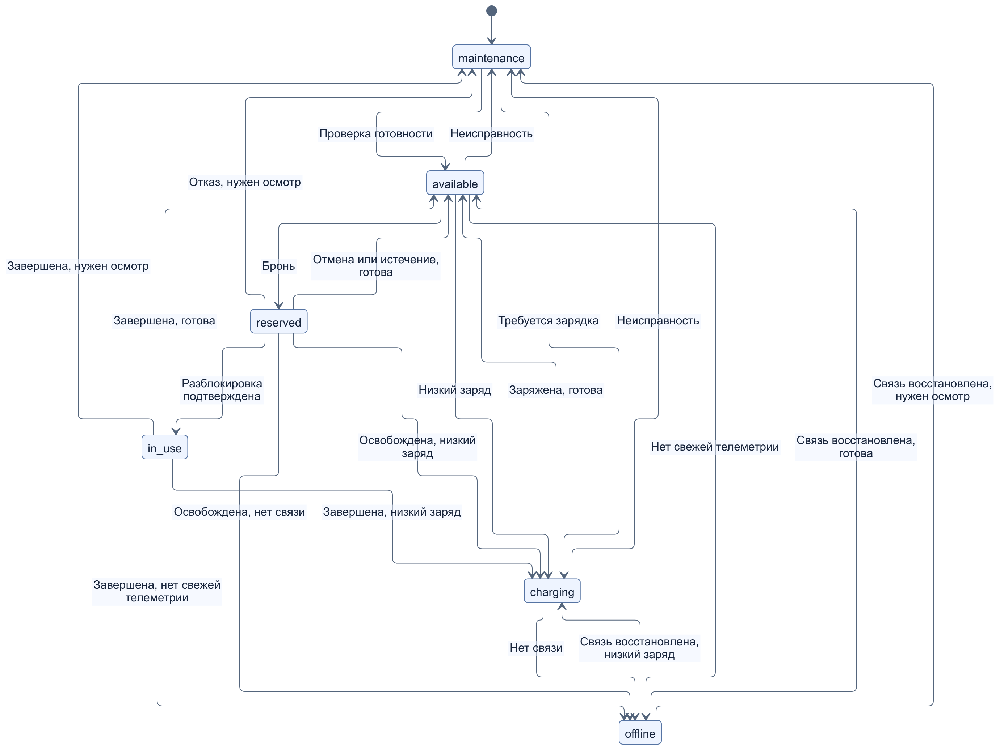
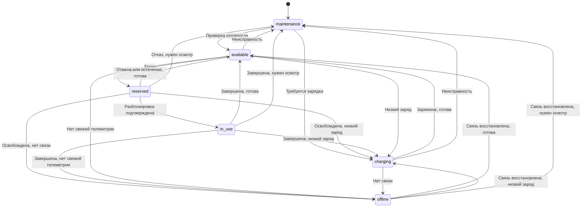
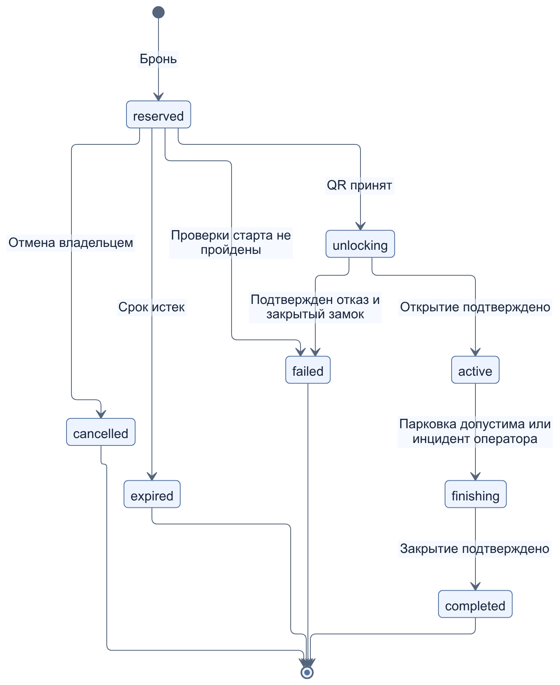
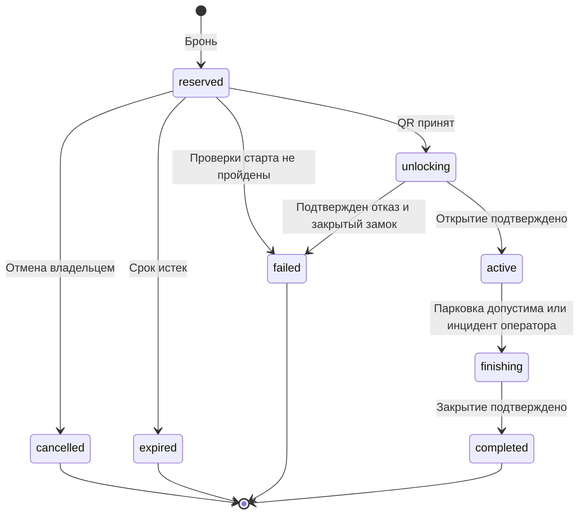

# П4. Спецификация модуля самокатов и велосипедов

[Все материалы недели](../../README.md) · [Қазақша](../kk/04-scooter-specification.md)

**Проект:** YaGo, учебное суперприложение для Астаны.  
**Этап:** неделя 2, проектная спецификация v1.  
**Ответственный:** П4; согласование модели данных — П3 и П5, карты — П2, доступа — П1.  
**Основание:** [ТЗ, неделя 2](../../../../TZ_13weeks_team_plan.md).

## 1. Назначение и границы

Модуль позволяет клиенту найти свободный самокат или велосипед на общей карте, узнать стоимость, забронировать технику, начать аренду по QR-коду, завершить ее в разрешенной парковочной зоне и получить расчет стоимости в истории заказов. Оператор контролирует состояние парка и разбирает технические ошибки. Сервер определяет допустимость переходов и стоимость; интерфейс показывает подтвержденное состояние.

Это результат проектирования второй недели, а не отчет о реализованном сервисе. В текущем коде:

- [server/src/index.js](../../../../server/src/index.js) возвращает флаг `scooter_tracking`, но не содержит хранилища техники, аренды, тарифов и геозон либо обработчиков разблокировки;
- [src/App.jsx](../../../../src/App.jsx) отображает рестораны, курьеров, такси и заказы; отдельного сценария аренды нет;
- заказы сохраняются в памяти процесса; произвольная строка статуса и передаваемая клиентом цена в текущем демонстрационном API не являются контрактом нового модуля;
- Leaflet/OpenStreetMap используются в работающем интерфейсе. Геоправила ниже не зависят от конкретного поставщика карты; интеграция 2ГИС предусмотрена общим ТЗ на последующих неделях.

Первая версия проектируется для `scooter` — электрического самоката и `bike` — обычного велосипеда с эмулируемым замком. Электровелосипед, пауза аренды, несколько одновременных аренд одного пользователя, абонементы, реальные платежи, штрафы, страхование и подключение физических IoT-устройств в эту версию не входят. Валидатор геозон и эмулятор замка предназначены для учебных сценариев; документ не подтверждает условия коммерческой эксплуатации или безопасность физического оборудования.

Связь с последующими неделями ТЗ: DFD — неделя 3; классификаторы — неделя 4; CRUD техники — неделя 5; QR-эмуляция и парковки — неделя 6; объединение с картой, заказами и скидками — неделя 8; панель оператора — неделя 9. Здесь фиксируются требования для этих работ, без миграций и реализации API.

## 2. Участники и доступ

| Участник | Разрешенные действия |
|---|---|
| Посетитель | Просмотр демонстрационной карты доступной техники и опубликованных тарифов |
| `client` | Просмотр своей аренды; бронь, QR-старт, отмена брони и запрос завершения только своей аренды; обращение о неисправности |
| `scooter_operator` | Проектная роль: осмотр, зарядка, подтверждение обслуживания, разбор зависших команд и завершение при инциденте с причиной в журнале |
| `admin` | Управление парком, тарифами, зонами, доступностью услуги и назначением ролей; также может выполнять действия оператора |
| Сервер | Проверка правил и прав, резервирование, расчет стоимости, таймеры, проекция состояния в общий заказ, выдача событий |
| Эмулятор техники | Ответ на команду замка, состояние замка, заряд и координаты тестовой техники; без права менять стоимость и владельца аренды |

Роли `driver`, `courier`, `restaurant` не получают прав оператора парка. `scooter_operator` — новая проектная роль, отсутствующая в текущем коде; реализация RBAC относится к последующим неделям. Оператор не редактирует тарифы, геозоны, роли пользователей и итоговые суммы напрямую. Ниже «оператор» означает `scooter_operator` или `admin` при выполнении операции обслуживания. Передача `userId`, статуса или итоговой цены в теле клиентского запроса не дает соответствующих полномочий. Идентификатор клиента берется из будущей проверенной сессии.

## 3. Общая модель данных и инварианты

Имена согласованы с [черновиком сущностей П3](../../p3/ru/03-database-entities.md) и [ER-моделью П5](../../p5/ru/05-er-model.md). Поля ниже — логический контракт; подробные типы, индексы и миграции относятся к следующим неделям.

| Сущность | Значение для модуля |
|---|---|
| `users` | Клиент, оператор и администратор; владелец аренды определяется через `orders.customer_id` |
| `orders` | Общая история услуг: `type=scooter\|bike`, `customer_id`, `status`, `tariff_id`, неизменяемый `tariff_snapshot`, `total_minor`, `currency=KZT` |
| `rentals` | Расширение заказа: уникальный `order_id`, `vehicle_id`, собственный `status`, `reserved_until`, `started_at`, `finish_requested_at`, `finished_at`, причина отмены/сбоя |
| `vehicles` | Общий парк: `kind=car\|scooter\|bike`; здесь используются только `scooter` и `bike`. Идентификатор QR, статус, координаты и их время, `telemetry_at`, `battery_percent`, `lock_state` |
| `tariffs` | Версионируемые тарифы по виду услуги: `unlock_fee_minor`, `price_per_minute_minor`, `currency`, `reservation_ttl_seconds`, `version`, `effective_from`, признак активности |
| `zones` | Активные полигоны с `kind=service\|parking\|no_parking`; связь с техникой вычисляется по ее координатам, отдельная таблица принадлежности не нужна |

Для `bike` значение `battery_percent=null` означает «не применимо», а не нулевой заряд. Состояние связи, качество координат и результат команды замка — отдельные признаки; они не заменяют статус занятой техники. Для `car` правила этого документа не действуют: доступность водителя определяется моделью исполнителей.

Обязательные инварианты:

1. Один заказ аренды имеет ровно одну запись `rentals`; заказ такси/доставки ее не имеет. `orders.type` совпадает с `vehicles.kind` арендованной техники.
2. У одной единицы техники и одного клиента не более одной незавершенной аренды со статусом `reserved`, `unlocking`, `active` или `finishing`. Ограничение действует для самоката и велосипеда вместе.
3. Статусы `available`, `maintenance`, `charging`, `offline` не допускают незавершенную аренду. Во время `reserved`/`unlocking` техника имеет статус `reserved`, во время `active`/`finishing` — `in_use`.
4. При потере связи во время аренды сохраняются ее владелец и занятость техники. Признак отсутствия связи не делает технику доступной.
5. Терминальные аренды не открываются повторно. Повторная поездка — новый заказ, новая аренда и новый снимок тарифа.
6. Все даты хранятся как UTC; интерфейс отображает время Астаны. Для тайм-аутов и расчетов используется серверное время, а не часы браузера.
7. Стоимость и новый статус подтверждаются сервером атомарно. Ошибка отправки WebSocket-события не отменяет уже сохраненный переход.

### Проекция в общий заказ

| `rentals.status` | `orders.status` | Стоимость |
|---|---|---|
| `reserved`, `unlocking` | `pending` | Начисление 0 до старта, окончательный итог еще не определен |
| `active`, `finishing` | `in_progress` | Показывается оценка, не окончательное списание |
| `completed` | `completed` | Один окончательный `total_minor` |
| `cancelled`, `expired`, `failed` | `cancelled` | `total_minor=0`; причина хранится в аренде |

`assigned` остается статусом такси/доставки. Статус `failed` у аренды возможен только до начала оплачиваемой поездки. Ошибка замка или связи после старта не превращает поездку в бесплатную отмененную аренду: она остается открытой до подтвержденного завершения и разбора инцидента.

## 4. Статусы техники

| Код | Смысл | Можно начать новую бронь |
|---|---|---|
| `available` | Техника исправна, замок закрыт, связь/позиция актуальны, условия выдачи выполнены | Да |
| `reserved` | Закреплена за одной незавершенной арендой; разблокировка также сохраняет этот статус | Нет |
| `in_use` | Поездка начата либо ожидается подтверждение ее завершения | Нет |
| `maintenance` | Неисправность, неизвестное состояние замка, требуется осмотр или перемещение | Нет |
| `charging` | Самокат выведен для зарядки | Нет; для `bike` статус недопустим |
| `offline` | У свободной техники нет актуальной связи/телеметрии | Нет |

Техника может перейти в `available` только после одной общей проверки готовности: нет открытой аренды; исправность подтверждена; замок `locked`; позиция и телеметрия свежие; точка внутри активной зоны обслуживания и разрешенной парковки, вне запретной парковки; для `scooter` заряд не ниже порога выдачи. Сам статус `available` без этих проверок и разрешенной выдачи услуги не разрешает резервирование. При QR-старте повторяются технические и географические проверки, но техника должна быть `reserved`, а единственная открытая аренда — текущей бронью клиента; требование отсутствия аренды действует только для перехода в `available` и новой брони.

| Переход | Инициатор | Предусловие и результат |
|---|---|---|
| Создание → `maintenance` | `admin` | Указаны вид и уникальный QR; новая запись проходит проверку перед выдачей |
| `maintenance` → `available` | Оператор | Осмотр/проверка готовы; все условия готовности соблюдены |
| `available` → `reserved` | Клиент через сервер | Все проверки готовности; успешно создана бронь и общий заказ в одной транзакции |
| `reserved` → `in_use` | Сервер по ответу эмулятора | Принадлежащая этой аренде команда разблокировки подтверждена |
| `reserved` → `available` | Сервер | Отмена/истечение брони или отказ до старта; замок достоверно закрыт и проверка готовности пройдена |
| `reserved` → `maintenance`/`charging`/`offline` | Сервер, при необходимости оператор | Аренда завершена без старта; результат диагностики требует осмотра, зарядки либо восстановления связи |
| `in_use` → `available`/`charging`/`maintenance`/`offline` | Сервер | Аренда завершена; замок подтвержден закрытым, затем выполнена классификация готовности |
| `available` → `maintenance`/`charging`/`offline` | Сервер или оператор | Дефект/перемещение, низкий заряд самоката либо устаревшая телеметрия; открытой аренды нет |
| `charging` → `available` | Сервер/оператор | Заряд достиг порога выдачи, все остальные условия готовности соблюдены |
| `charging` → `maintenance`/`offline` | Сервер/оператор | Дефект либо потеря связи при зарядке |
| `maintenance` → `charging` | Оператор | Самокат исправен, нуждается в зарядке; открытой аренды нет |
| `offline` → `available`/`charging`/`maintenance` | Сервер/оператор | Связь восстановлена; актуальное состояние определяет следующий статус |

Классификация после освобождения выполняется в порядке: подтвержденная неисправность/неизвестный замок → `maintenance`; отсутствующая актуальная телеметрия → `offline`; низкий заряд самоката → `charging`; невыполнение геоусловий → `maintenance`; иначе `available`. Во время открытой аренды все эти признаки регистрируются как инцидент, но переход техники в свободный статус запрещен.



*Переходы состояний самоката или велосипеда с учётом аренды, заряда, неисправностей и связи.* [Открыть SVG для увеличения](diagrams/vehicle-states.svg).

<details>
<summary>Исходник Mermaid</summary>



</details>

## 5. Жизненный цикл аренды

| Код | Значение |
|---|---|
| `reserved` | Бесплатная бронь до `reserved_until` |
| `unlocking` | Сервер принял QR-старт и ожидает результат команды замка |
| `active` | Открытие подтверждено, зафиксировано `started_at`, идет аренда |
| `finishing` | Принят допустимый запрос завершения, ожидается закрытие/разбор ошибки; техника остается занятой |
| `completed` | Закрытие подтверждено, время и итоговая цена зафиксированы |
| `cancelled` | Клиент отменил бронь до начала разблокировки |
| `expired` | Время брони истекло до начала разблокировки |
| `failed` | Старт не состоялся по подтвержденной технической причине; оплаты нет |

| Переход | Инициатор | Предусловия и обязательные действия |
|---|---|---|
| Нет аренды → `reserved` | `client` | Доступная техника, подходящий активный тариф, пользователь без другой открытой аренды; сохранить снимок тарифа и срок брони |
| `reserved` → `cancelled` | Владелец аренды | Команда открытия еще не принята; освободить технику после проверки состояния, сумма 0 |
| `reserved` → `expired` | Серверный таймер или обработка следующего запроса | `now >= reserved_until`; атомарно освободить технику, сумма 0 |
| `reserved` → `unlocking` | Владелец по QR | `now < reserved_until`, QR соответствует технике; повторные проверки замка, заряда, связи, геоусловий и доступности услуги; техника `reserved` принадлежит текущей брони; отправка одной команды открытия |
| `reserved` → `failed` | Сервер/оператор | До команды обнаружена неисправность/недостаточный заряд/недостоверная телеметрия либо услуга отключена; открытие не выполнялось, замок закрыт; сумма 0 |
| `unlocking` → `active` | Сервер по ответу эмулятора | Подтвержден `unlocked` для текущей команды; один раз зафиксировать `started_at` |
| `unlocking` → `failed` | Сервер/оператор | Получен однозначный отказ открытия и подтвержден `locked`; сумма 0, причина сохранена |
| `active` → `finishing` | Владелец через сервер | Валидная позиция, допустимая парковка, эмулятор подтверждает остановку; сохранить `finish_requested_at`, отправить команду закрытия |
| `active` → `finishing` | Оператор при инциденте | Обращение/инцидент зарегистрирован; оператор подтвердил остановку/изъятие и основание исключения из геопроверки; сохранить автора, причину и расчетный момент остановки тарификации |
| `finishing` → `completed` | Сервер/оператор | Подтвержден `locked` либо оператором подтверждено изъятие и закрытие в эмуляции; один раз сохранить `finished_at` и стоимость, освободить технику в подходящий статус |

Все неуказанные переходы запрещены. У открытой аренды нельзя сменить владельца, технику или снимок тарифа. Отмена `active` не предусмотрена: используется завершение. В v1 нет перехода `finishing → active` и режима паузы; при сбое завершения пользователь получает состояние ожидания и возможность обратиться к оператору.



*Переходы состояний аренды: бронирование, открытие замка, поездка и подтверждённое завершение.* [Открыть SVG для увеличения](diagrams/rental-states.svg).

<details>
<summary>Исходник Mermaid</summary>



</details>

Тайм-аут команды не является доказательством отказа. При неизвестном результате аренда остается `unlocking` или `finishing`; техника остается занятой. `reserved_until` больше не завершает аренду, если команда открытия была принята до истечения брони. Для зависших команд предусмотрены повторное чтение состояния и инцидент оператора.

## 6. Тарифы и расчет

Все числа в этом разделе — **учебные допущения для проверки проекта**, а не действующие цены сервисов Астаны или коммерческое предложение YaGo. Тариф действует для одного вида техники в демонстрационной зоне. Правило v1: один активный применимый тариф на вид услуги; при отсутствии или неоднозначности тарифа бронь отклоняется.

| Параметр | Самокат `scooter` | Велосипед `bike` |
|---|---:|---:|
| Валюта | KZT | KZT |
| Разблокировка `unlock_fee_minor` | 10 000 тиын = 100 ₸ | 5 000 тиын = 50 ₸ |
| Минута `price_per_minute_minor` | 3 000 тиын = 30 ₸ | 1 500 тиын = 15 ₸ |
| Бесплатная бронь `reservation_ttl_seconds` | 120 секунд | 120 секунд |
| Округление времени | Каждая начатая минута вверх, минимум 1 минута после успешного старта | То же |

Денежные величины хранятся целыми числами минимальных единиц: `100` тиын = `1` KZT. Расчет не использует двоичный `float` и переданную клиентом сумму. Итог отображается в тенге; дробная часть при необходимости содержит две цифры.

Для успешно начатой аренды:

```text
duration_ms = max(0, billing_end_at - started_at)
billable_minutes = max(1, ceil(duration_ms / 60_000))
total_minor = tariff_snapshot.unlock_fee_minor
            + billable_minutes * tariff_snapshot.price_per_minute_minor
```

`billing_end_at` — расчетный момент окончания, логическое значение в результате расчета; в обычном сценарии это первый **принятый сервером** `finish_requested_at`. Он фиксируется только после проверок парковки, свежести позиции и остановки. Отклоненная попытка завершения не останавливает счетчик. `finished_at` — время подтверждения закрытия и окончательного завершения, оно может быть позже. Разница не оплачивается: задержка ответа замка после допустимого запроса завершения относится на демонстрационный сервис.

При зависшем закрытии оценка суммы замораживается на `finish_requested_at`, но окончательный итог появляется только после подтверждения завершения. Принятая попытка не отзывается, повторные запросы не сдвигают расчетный момент. Для операторского завершения при инциденте расчетный момент — серверное время регистрации обращения клиента, а если обращения нет — время принятия инцидента оператором; он не может быть раньше `started_at` или позже фактического завершения. Время и причина сохраняются в журнале. Это отдельное учебное правило компенсации технических задержек; дополнительных штрафов нет.

До успешной разблокировки начислений нет. Для `cancelled`, `expired`, `failed` итог строго 0; минимальная минута и плата за старт не применяются. Открытая аренда имеет предварительную оценку, а не завершенное списание. Отдельный платежный шлюз в v1 не подключается.

| Кейс | Оплачиваемое время | Расчет | Итог |
|---|---:|---|---:|
| Самокат, завершение сразу после успешного старта | 0 мс → 1 мин | 100 + 1 × 30 | 130 ₸ |
| Самокат, ровно 60 секунд | 1 мин | 100 + 1 × 30 | 130 ₸ |
| Самокат, 60 секунд и 1 мс | 2 мин | 100 + 2 × 30 | 160 ₸ |
| Самокат, 7 мин 20 сек | 8 мин | 100 + 8 × 30 | 340 ₸ |
| Велосипед, 7 мин 20 сек | 8 мин | 50 + 8 × 15 | 170 ₸ |
| Бронь отменена или истекла, открытия не было | Не тарифицируется | 0 | 0 ₸ |
| Самокат: допустимое завершение на 7:20, ответ замка на 7:50 | 8 мин | 100 + 8 × 30 | 340 ₸ |

При бронировании в `orders.tariff_snapshot` копируются версия тарифа, обе ставки, валюта, срок брони и правило округления. Изменение справочника не пересчитывает существующую бронь/поездку. Скидки и surge отложены до недели 8; текущая формула использует скидку 0 и коэффициент 1. Добавление этих правил потребует новой версии тарификации и согласования с П3.

## 7. Карта, геозоны и заряд

### 7.1. Геометрия и парковка

В первой версии используются учебные полигоны в Астане, задаваемые администратором. Это не официальная карта разрешенных стоянок. Геометрия хранится в WGS 84; для GeoJSON порядок координат `[longitude, latitude]`, тогда как Leaflet принимает `[latitude, longitude]`. Преобразование выполняется в адаптере карты.

| `zones.kind` | Правило |
|---|---|
| `service` | Бронь и обычное завершение возможны внутри активной зоны обслуживания |
| `parking` | Обычное завершение возможно только внутри активного парковочного полигона |
| `no_parking` | Запрещает обычное завершение, даже если точка входит в парковочный полигон |

Условие разрешенной парковки: `inside(service) AND inside(parking) AND NOT inside(no_parking)`. Граница полигона считается входящей в него; следовательно, граница запретной парковки также запрещена. Объединение нескольких активных полигонов одного типа работает по правилу «внутри хотя бы одного». При отсутствии активных зон завершение по обычному сценарию недоступно. Удаление/изменение зоны не меняет уже принятую попытку завершения; при приеме сохраняются результаты проверки и версии зон.

Сервер проверяет принадлежность геозонам. Проверка в интерфейсе лишь объясняет доступность кнопки. Вне разрешенного места клиент видит причину и доступные парковки на карте; аренда сохраняет `active`, тарификация продолжается. Пересечение границы `service` во время поездки вызывает уведомление и инцидент, но не команду удаленной блокировки движущейся техники. Возврат в зону позволяет продолжить обычное завершение.

Проектные настройки эмуляции:

- свежесть телеметрии для выдачи — возраст не больше 60 секунд;
- свежесть координаты для завершения — возраст не больше 30 секунд;
- допустимая точность координат — не хуже 30 метров, координаты и время обязательны;
- `now - measured_at` неотрицательно; неизвестное время, отрицательный возраст, координаты вне допустимого диапазона или неприемлемая точность делают измерение недействительным.

Эти числа служат настройками тестового стенда, а не гарантией точности GPS. Для завершения используется доверенный серверу источник эмулятора; клиентская координата без проверки не считается телеметрией техники. Отсутствие координаты запрещает обычное завершение и предлагает обновление данных/обращение оператору; отказ не выдумывает положение техники. При необходимости оператор подтверждает изъятие в рамках тестового инцидента и отправляет технику в `maintenance`.

### 7.2. Заряд

Учебные пороги для `scooter`: бронь и старт разрешены при `battery_percent >= 20`; диапазон допустимых значений — от 0 до 100. Неизвестный, устаревший или некорректный заряд запрещает выдачу. Проверка повторяется перед открытием: заряд мог снизиться за время брони.

Во время аренды заряд ниже 20% вызывает предупреждение, 5% и ниже — дополнительное предложение завершить поездку в ближайшей разрешенной парковке и зарегистрировать инцидент. Ни один порог сам по себе не завершает аренду и не блокирует замок. Завершение разрешено при любом заряде, если соблюдены остальные условия; после него самокат с зарядом ниже 20% получает `charging`. Для обычного `bike` правила батареи не применяются.

### 7.3. Сезонная доступность

`admin` управляет проектной настройкой выдачи по виду услуги: `scooter_enabled` и `bike_enabled`. Она применяется для сезонной остановки или обслуживания парка; календарные даты и погодные пороги команда в v1 не задает. Это учебное операционное решение, а не ссылка на ограничения законодательства.

Отключение услуги запрещает новые брони и прием новых команд QR-старта, даже для технически исправного `available` транспорта. Уже созданная `reserved` аренда завершается с `failed`, причиной `service_unavailable` и суммой 0, если достоверно известно, что команда открытия не отправлялась и замок закрыт; при неопределенном замке сначала выполняется сверка. Отключение не отменяет уже отправленную команду `unlocking` и не блокирует завершение `active`/`finishing`. Техника после завершения классифицируется по своему состоянию, но не выдается, пока услуга отключена. Повторное включение не восстанавливает отмененные брони и не пропускает проверку готовности.

## 8. QR, бронь и сбои

### 8.1. Обычный сценарий

1. Карта показывает технику, прошедшую проверку доступности; карточка содержит вид, идентификатор, заряд для самоката, время последнего обновления, тариф и правило округления.
2. Авторизованный клиент выбирает технику и подтверждает бронь. Сервер атомарно создает заказ и аренду, устанавливает `reserved_until = now + 120 секунд` согласно снимку тарифа и возвращает оставшееся время.
3. Клиент сканирует QR или вводит его текст в учебной форме. QR содержит версию формата и непрозрачный идентификатор техники, например `yago:v1:vehicle:<qr-id>`; код не содержит пароль, токен доступа, цену или команду замка.
4. Сервер проверяет владельца брони, формат и соответствие QR, время и готовность техники, переводит аренду в `unlocking`, создает идентификатор команды и вызывает эмулятор.
5. Подтвержденное открытие переводит аренду в `active`, технику — в `in_use`. Клиент видит таймер и предварительную стоимость.
6. После допустимого запроса завершения аренда переходит в `finishing`; подтверждение закрытия завершает аренду и общий заказ. В истории отображаются длительность, оплачиваемые минуты, снимок ставок и итог.

Сканирование без брони открывает карточку и требует обычного подтверждения брони; само по себе оно не открывает замок. QR другой техники не переносит существующую бронь и не создает вторую аренду. Неизвестный либо поврежденный QR возвращает понятную ошибку без изменения состояния.

### 8.2. Бронь и конкуренция

Бронь бесплатна. Срок определяется сервером и не продлевается повторным чтением карточки, перезагрузкой страницы или повтором запроса. При `now == reserved_until` бронь уже истекла. Фоновый обработчик освобождает истекшие брони; обработчик новой брони/старта также проверяет срок под блокировкой, поэтому задержка фоновой задачи не разрешает просроченный старт.

Создание брони блокирует/условно обновляет запись техники, проверяет отсутствие другой открытой аренды пользователя и записывает `orders`, `rentals`, статус техники в одной транзакции. Ограничения базы должны исключать две открытые аренды одного клиента даже на двух разных единицах техники. Проигравший в гонке получает конфликт; у него не появляется ни заказ, ни начисление.

Если отмена и QR-старт приходят одновременно, побеждает первый допустимый переход, зафиксированный сервером. После принятия `unlocking` отмена и таймер брони не освобождают технику. При одновременном истечении срока и старте время проверяется в той же транзакции, что и переход; начало при `now >= reserved_until` отклоняется.

Каждая команда клиента на создание брони, старт, отмену и завершение имеет ключ идемпотентности, ограниченный владельцем и операцией. Повтор с тем же ключом и тем же содержимым возвращает сохраненный результат; тот же ключ с другим содержимым — конфликт. Ключи создания брони сохраняются и после ее истечения, поэтому повтор старого запроса не создает новую бронь. Эмулятор тоже дедуплицирует команды по `command_id`. При повторе завершения не создаются второй итог и второе событие изменения состояния; уведомление можно доставить повторно с тем же идентификатором/версией.

### 8.3. Неопределенный результат и восстановление

| Событие | Реакция сервера и клиента |
|---|---|
| Замок вернул отказ открытия и `locked` | `failed`, итог 0; подтвержденная неисправность отправляет технику в `maintenance` |
| Нет ответа замка 15 секунд | Проектный тайм-аут: повторное чтение состояния и инцидент; `unlocking`/`finishing` сохраняются, новая аренда запрещена |
| Позднее подтверждение открытия | Принять только для актуального `command_id` и ожидающего состояния; один старт и одно `started_at` |
| Неизвестен результат открытия | Начисления не начинаются до подтверждения. Оператор/эмулятор восстанавливает состояние; нельзя объявить технику свободной лишь по тайм-ауту |
| Подтвержденное открытие сохранено, ответ клиенту потерялся | Повтор/чтение аренды возвращает `active` с исходным `started_at`; таймер не начинается заново |
| Сбой закрытия после допустимой парковки | Оставить `finishing` и занятую технику; оценка заморожена на принятом времени завершения; повторить ту же команду или передать оператору |
| Потеря связи телефона | Состояние остается на сервере; локальное закрытие окна не завершает аренду. После восстановления клиент загружает свою открытую аренду |
| Потеря телеметрии техники во время поездки | `active` и `in_use` сохраняются, последнее положение отмечается устаревшим; открыть инцидент, не подставлять координаты клиента |
| Противоречащий/старый ответ замка | Не применять к новой аренде/команде; зарегистрировать несогласованность и проверить фактическое состояние |
| Перезапуск сервера | Восстановить открытые аренды, сроки и незавершенные команды из БД; просрочить только `reserved`, сверить `unlocking`/`finishing` с эмулятором |

Подтверждение команды означает серверное событие эмулятора, сохраненное вместе с переходом состояния. Если ответ получил интерфейс, но серверный переход не сохранен, интерфейс не вправе самостоятельно считать поездку начатой/законченной. Для реальных устройств правила сверки потребуют отдельного протокола; их поддержка не заявлена в v1.

## 9. Входы, выходы и взаимодействие модулей

| Операция будущего сервиса | Основные входы | Результат |
|---|---|---|
| Найти технику | Границы карты, вид техники | Доступные карточки и свежесть данных |
| Забронировать | Сессия клиента, `vehicle_id`, ключ идемпотентности | Заказ, аренда, снимок тарифа, срок |
| Отменить бронь | Своя аренда, ключ | Терминальное состояние либо конфликт |
| Начать аренду | Своя аренда, QR, ключ | Состояние `unlocking`/`active` либо причина отказа |
| Завершить | Своя аренда, ключ; позиция/остановка из эмулятора | `finishing`/`completed`, время и расчет либо причина отказа |
| Получить состояние | Свой `order_id`/открытая аренда | Согласованные заказ, аренда, техника и версия состояния |
| Обслужить/разобрать инцидент | Сессия оператора, техника/аренда, причина, подтверждения | Допустимый переход и запись журнала |

Это логические операции, а не уже существующие HTTP-маршруты. Общий сервис заказов принимает проекцию аренды; он не должен обходить автомат состояний вызовом универсального «установить статус». Сервис карты получает положение, статус и признаки актуальности. События о технике и аренде отправляются после фиксации транзакции; частные сведения об аренде доступны владельцу и `admin`; оператору — данные назначенного инцидента, а публичной карте достаточно положения и доступности.

Журнал переходов содержит идентификаторы аренды/техники/команды, старое и новое состояния, серверное время, инициатора, причину, версию тарифа и ключ события. Изменение тарифа или зоны публикуется новой версией; использованные версии сохраняются для объяснения суммы и решения о парковке. Удаление записи техники с историей заменяется выводом из эксплуатации, чтобы история заказа оставалась читаемой.

## 10. Критерии приемки будущей реализации

Вторая неделя принимается по наличию согласованной спецификации, статусных переходов, тарифной формулы и связи с ER-моделью. Таблица ниже — проверяемые сценарии для реализации следующих недель, а не утверждение об уже пройденных программных тестах. Исходное состояние каждого кейса задается независимо; если не оговорено иное, используются учебные тарифы и корректная техника в разрешенной зоне.

| № | Дано / действие | Ожидаемый результат |
|---|---|---|
| SC-01 | Свободный самокат, заряд 80%; бронь → правильный QR → 7:20 → допустимое завершение | `reserved → unlocking → active → finishing → completed`, техника освобождена, заказ `completed`, итог 340 ₸ |
| SC-02 | Обычный велосипед с `battery_percent=null`, аренда 7:20 | Проверка заряда пропущена, итог 170 ₸, `charging` не присваивается |
| SC-03 | Самокат 19% / ровно 20% / неизвестный заряд | 19% и неизвестный заряд запрещают бронь; 20% допускает при остальных выполненных условиях |
| SC-04 | Во время брони заряд снизился с 21% до 19%; затем QR-старт | Открытие не выполняется; аренда `failed`, итог 0, техника `charging` при исправности и актуальной связи |
| SC-05 | Два клиента одновременно бронируют одну технику | Ровно одна открытая аренда и один успешный заказ; второму конфликт |
| SC-06 | Один клиент одновременно бронирует две единицы техники | Ровно одна бронь; ограничение проверено на сервере/в БД |
| SC-07 | Отмена до команды открытия | `cancelled`, сумма 0, техника доступна только после проверки готовности |
| SC-08 | QR-старт при `now == reserved_until`; фоновая задача задержалась | `expired`, старт отклонен, сумма 0 |
| SC-09 | Старт принят до срока, ответ замка пришел после `reserved_until` | Таймер не освобождает технику; подтверждение дает единственную `active` аренду |
| SC-10 | Неизвестный QR / QR другой техники / старт чужой аренды | Ошибка без изменения состояния, без команды замка и начисления |
| SC-11 | Повтор брони/старта/завершения с тем же ключом и содержимым | Возвращается прежний результат; дубликата заказа, команды, старта и итоговой суммы нет |
| SC-12 | Тот же владелец, операция и ключ, но другой `vehicle_id`/содержимое | Конфликт содержимого; ранее созданная бронь не изменяется. Другая операция имеет отдельную область ключей |
| SC-13 | Одновременно отмена и старт | Зафиксирован один разрешенный переход; после `unlocking` отмена не освобождает технику |
| SC-14 | Подтвержденный отказ открытия / ответ открытия отсутствует | В первом случае `failed` и 0; во втором `unlocking`, техника занята, инцидент, начислений до подтверждения нет |
| SC-15 | Завершение вне `parking`, вне `service` или внутри `no_parking` | Отказ с причиной; `active`, начисление продолжается, на карте показаны парковки |
| SC-16 | Точка на границе `parking` / границе перекрывающей `no_parking` | Первая допустима при прочих условиях; вторая запрещена |
| SC-17 | Нет координат / возраст 31 сек / точность хуже 30 м / время из будущего | Обычное завершение отклонено, предложены обновление/оператор; положение не выдумано |
| SC-18 | Потеря телеметрии в поездке, заряд стал 5%, выход за `service` | Техника остается `in_use`; уведомления и инцидент; автоматической блокировки/отмены нет |
| SC-19 | Допустимое завершение на 7:20; подтверждение закрытия задержано | `finishing`, техника занята, оценка 340 ₸; после подтверждения один итог 340 ₸ |
| SC-20 | Замок не закрылся, затем оператор подтвердил закрытие/изъятие | До подтверждения техника не выдается; завершение с исходным расчетным временем и журналом причины, техника `maintenance` при дефекте |
| SC-21 | Самокат: время 0 мс, 60 000 мс, 60 001 мс | Итоги соответственно 130, 130, 160 ₸; округление выполняется один раз |
| SC-22 | Тариф изменен после брони; поездка завершена | Расчет по сохраненному снимку; новая бронь получает новую версию |
| SC-23 | Нет подходящего тарифа или активной геозоны | Бронь/обычное завершение отклонены по соответствующему правилу; цена или зона по умолчанию не выдумываются |
| SC-24 | Перезагрузка страницы, разрыв WebSocket или перезапуск сервера в открытой аренде | Состояние восстанавливается из сервера/БД, исходные сроки и цена сохранены, вторая аренда не появляется |
| SC-25 | Старое событие замка пришло после новой команды/новой аренды | Новое состояние не перезаписано, зарегистрирована несогласованность |
| SC-26 | `client` пытается поменять статус, цену, тариф или вызвать операторское завершение | Отказ в полномочиях; сохраненные данные не изменены |
| SC-27 | Завершенный заказ пытаются открыть заново либо повторно завершить | Новая поездка требует нового заказа; повтор старого завершения возвращает прежний итог |
| SC-28 | `admin` выключил `scooter_enabled` при свободной технике, действующей брони и начатой поездке | Новая бронь/новый QR-старт запрещены; бронь закрывается без оплаты после проверки замка; начатая поездка доступна для обычного завершения, замок автоматически не блокируется |
| SC-29 | `scooter_operator` выполняет обслуживание, затем пытается изменить тариф/геозону/роль | Разрешенное обслуживание проходит с журналом причины; изменение тарифов/зон/ролей отклонено |

Спецификация считается согласованной с данными, если П3/П5 используют те же имена `vehicles`, `rentals`, `orders`, `tariffs`, `zones`, отдельные статусы аренды и техники, снимок тарифа на заказе и связь одной аренды с одним заказом. Пороговые значения и цены могут меняться по решению команды, но такое изменение должно отражаться в версии требований и приемочных примерах.
