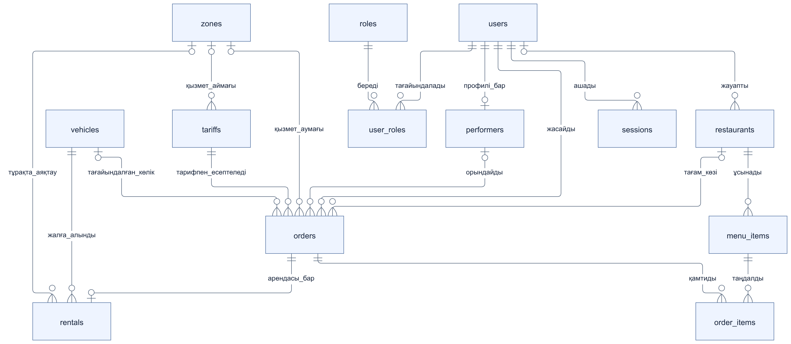
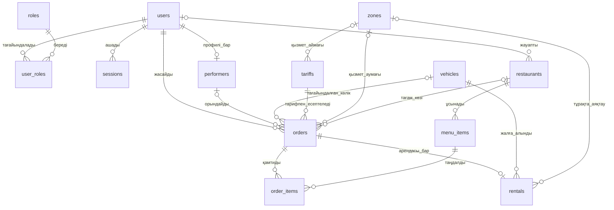

# YaGo алғашқы концептуалдық ER-моделі

[Аптаның барлық материалдары](../../README.md) · [Орысша](../ru/05-er-model.md)

**Кезең:** 2-апта. **Жауапты:** П5. Бұл болашақ деректер байланыстары; кестелер мен миграциялар әлі жасалмаған.

## 1. Концептуалдық диаграмма

Модель 13 нысанды біріктіреді: пайдаланушылар, рөлдер, сессиялар, орындаушылар, техника, тапсырыстар, аренда, тарифтер, аймақтар, мейрамханалар және мәзір. [SVG нұсқасы](diagrams/er-model.svg).

## 2. Негізгі шешімдер

`orders` барлық қызметтерге ортақ тарихты сақтайды, ал `rentals` самокат/велосипедке тән статус пен техниканы қосады. `orders.type` мәндері `taxi`, `delivery`, `scooter`, `bike`; тағам жеткізу `delivery_kind=food` ретінде бөлінеді. `tariff_snapshot` аяқталған тапсырыстың есебін тариф өзгерісінен қорғайды.

Техника мен клиенттің параллель аяқталмаған арендалары болмауы керек. Ресторан тек тағам жеткізуге, `assigned_vehicle_id` такси/курьер көлігіне, `rentals.vehicle_id` клиент жалға алған техникаға қатысты. Геозоналарға сілтеме координатаны серверлік тексеруді алмастырмайды.

## 3. Келесі қадамдар

3-аптада атрибуттар мен міндетті байланыстар нақтыланады. 4-аптада PostgreSQL/PostGIS кестелері, индекстер, миграциялар және seed-деректер жасалады. Бұл диаграмма іске асқан база емес, архитектуралық тапсырма T3/2-апта үшін келісілген модель.
