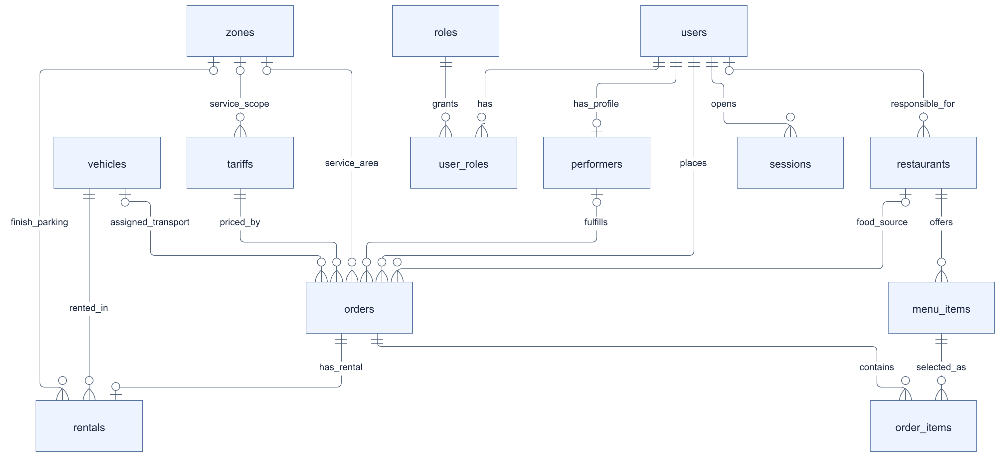
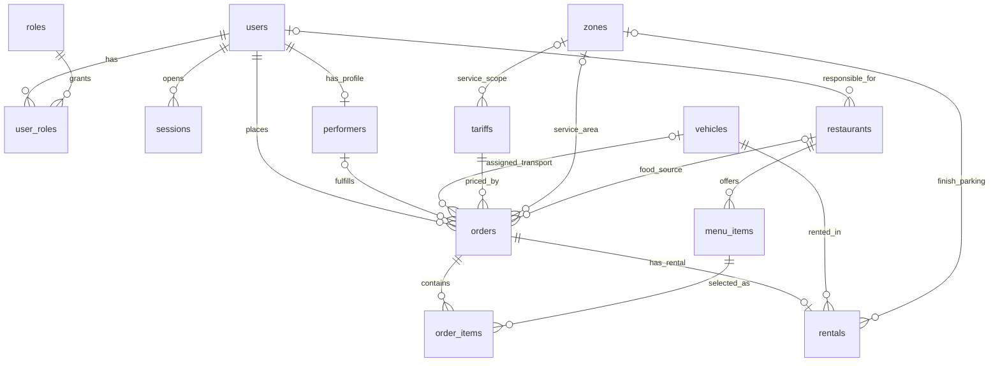

# П5. Первая концептуальная ER-модель

[Все материалы недели](../../README.md) · [Қазақша](../kk/05-er-model.md)

Версия: 1.0, неделя 2. Ответственный: П5 — Admin Panel & Analytics. Вход: [перечень сущностей П3](../../p3/ru/03-database-entities.md) и [спецификация самокатов/велосипедов П4](../../p4/ru/04-scooter-specification.md).

Модель описывает будущие связи данных YaGo. Сейчас таблицы не созданы: сервер хранит рестораны, меню, исполнителей и заказы в памяти. Диаграмма не означает выполненную миграцию в PostgreSQL/PostGIS. Детальные колонки, ключи, индексы и SQL запланированы на недели 3–4.

## 1. Концептуальная диаграмма

Названия сущностей совпадают с П3. В Mermaid `||` означает ровно один объект, `o|`/`|o` — ноль или один, `o{` — ноль или много. Необязательность отдельных связей уточняется типом заказа: например, ресторан необязателен в общем `orders`, но обязателен для доставки еды.

*Концептуальная ER-модель YaGo: сущности и кратности связей общей модели данных.* [Открыть SVG для увеличения](diagrams/er-model.svg).

Исходник Mermaid

Три связи с `zones` имеют разные роли. `tariffs.service_zone_id` и `orders.service_zone_id` относятся к зоне `service`; конечная зона аренды относится к `parking`. Запреты `no_parking` проверяются пространственно. Отдельная таблица постоянной принадлежности движущейся техники геозонам не нужна: положение меняется, а зоны могут пересекаться.

## 2. Смысл сущностей и ключевых связей

| Группа | Сущности | Решение модели |
|---|---|---|
| Идентификация и доступ | `users`, `roles`, `user_roles`, `sessions` | Учётная запись одна, ролей может быть несколько. Каждая сессия принадлежит одному пользователю. |
| Исполнение | `performers`, `vehicles` | Профиль курьера/водителя связан с пользователем; техника существует отдельно. Для аренды исполнитель не требуется. |
| Услуги | `orders`, `rentals` | Общая история и агрегаты строятся по заказам. Аренда расширяет один заказ, добавляя технику и собственный автомат состояний. |
| Тарификация и география | `tariffs`, `zones` | Тариф привязан к услуге, а при необходимости — к сервисной зоне. В заказе сохраняется снимок применённых условий. |
| Доставка еды | `restaurants`, `menu_items`, `order_items` | Ресторан публикует меню; заказ содержит строки с зафиксированной ценой и названием. |

| Связь | Кардинальность и обязательность |
|---|---|
| Пользователь → роли | `0..N` назначений на пользователя и `0..N` пользователей на роль; пара `user_id + role_code` уникальна. Для доступа к защищённому сценарию требуется соответствующая роль. |
| Пользователь → сессии | `1 : 0..N`; каждая сессия имеет одного владельца. Отзыв одной сессии не удаляет пользователя. |
| Пользователь → профиль исполнителя | `1 : 0..1`; профиль имеет ровно одного пользователя, категория `courier` или `driver`. |
| Пользователь → заказы | `1 : 0..N`; каждый оформленный заказ имеет одного заказчика `customer_id`. |
| Пользователь → рестораны | Ответственный аккаунт может вести `0..N` ресторанов; у ресторана `0..1` ответственный аккаунт. Ресторан может быть добавлен до выдачи аккаунта. Полный состав сотрудников — расширение. |
| Исполнитель → заказы | У исполнителя `0..N` заказов в истории; у заказа `0..1` назначенный исполнитель. В работе такси/доставки исполнитель обязателен; у аренды отсутствует. |
| Техника → заказы такси/доставки | У техники `0..N` заказов в истории; у заказа `0..1` `assigned_vehicle_id`. Это транспорт исполнителя, а не арендованная клиентом техника. Детали автомобильного парка уточняются далее. |
| Тариф → заказы | У тарифа `0..N` заказов; для каждого нового заказа выбирается один тариф. `tariff_snapshot` сохраняет применённую версию и параметры. |
| Сервисная зона → тарифы | Зона имеет `0..N` тарифов; тариф имеет `0..1` зону `service`. Без ссылки он действует для своей услуги во всей территории, разрешённой системой; это не разрешение поездок вне сервисных зон. |
| Сервисная зона → заказы | Зона имеет `0..N` заказов; заказ имеет `0..1` выбранную сервисную зону. Для выдачи аренды она обязательна. При пересечении подходящих сервисных зон выбирается одна, её идентификатор фиксируется в заказе. |
| Ресторан → меню | `1 : 0..N`; позиция меню принадлежит ровно одному ресторану. |
| Ресторан → заказы | `1 : 0..N` в истории; у заказа `0..1` ресторан. Для `delivery/food` — ровно один, для остальных услуг — ни одного. |
| Заказ → строки заказа | `1 : 0..N` в общей модели; для доставки еды — `1..N`, для остальных услуг — ноль. Каждая строка относится к одному заказу и одной позиции меню. |
| Заказ → аренда | `1 : 0..1` в общей модели; для `scooter`/`bike` — ровно одна, для `taxi`/`delivery` — ни одной. `rentals.order_id` уникален. |
| Техника → аренды | `1 : 0..N` в истории; каждая аренда относится к одной единице техники. Историческая множественность не разрешает параллельные активные аренды. |
| Парковочная зона → аренды | У зоны `0..N` завершений; у аренды `0..1` конечная парковочная зона. При штатном завершении парковочная зона обязательна; до него может отсутствовать. |

## 3. Разделение общих и специальных данных

| Данные | Место хранения | Причина |
|---|---|---|
| Заказчик, услуга, общий статус, создание/завершение | `orders` | Общий список заказов клиента и единая аналитика услуг. |
| Тариф, снимок тарифа, валюта и итог | `orders` | Исключается повтор суммы между заказом и арендой. Параметры тарифа применяются на сервере. |
| Курьер/водитель и транспорт исполнителя | `orders.performer_id`, `orders.assigned_vehicle_id` | Эти поля относятся к такси/доставке и не заполняются для клиентской аренды. |
| Техника клиента, бронь, разблокировка, завершение | `rentals` | Специальный жизненный цикл не перегружает заказ еды или такси. |
| Актуальное имя/цена блюда | `menu_items` | Ресторан может менять предложение для новых заказов. |
| Название/цена в оформленном заказе | Снимки в `order_items` | Изменение меню не переписывает историю покупки. |
| Позиции исполнителей и техники | Соответствующий объект + время позиции | Это последний известный факт; история треков — будущая отдельная сущность. |

`orders.type` принимает `taxi`, `delivery`, `scooter`, `bike`. Для доставки дополнительный `delivery_kind` имеет значение `food` или `parcel`. В текущем API есть только `food` и `taxi`; переход `food → delivery/food` является проектным решением, а не уже выполненной сменой API.

Таблицы аналитики в первый вариант не добавляются. Количество заказов, время ожидания и начисленная стоимость выводятся из согласованных статусов, времён и итогов. До появления платежей сумму завершённых заказов следует называть стоимостью оказанных услуг, а не подтверждёнными поступлениями денег.

## 4. Целостность модели

### Обязательность по услуге

| Поле/связь | `taxi` | `delivery/food` | `delivery/parcel` | `scooter` / `bike` |
|---|---|---|---|---|
| Заказчик и тариф | Обязательны | Обязательны | Обязательны | Обязательны |
| Исполнитель | После назначения, категория `driver` | После назначения, категория `courier` | После назначения, категория `courier` | Отсутствует |
| Ресторан | Отсутствует | Обязателен | Отсутствует | Отсутствует |
| Строки еды | Отсутствуют | Не менее одной | Отсутствуют | Отсутствуют |
| `assigned_vehicle_id` | Допустим `car` | Необязательный транспорт курьера | Необязательный транспорт курьера | Отсутствует |
| `rentals` | Отсутствует | Отсутствует | Отсутствует | Ровно одна запись |
| `rentals.vehicle_id` | — | — | — | Обязателен; `vehicles.kind` совпадает с типом заказа |
| Начальная/конечная точка | Обязательны при оформлении | Ресторан и адрес доставки | Отправление и получение | Начало фиксируется по технике; конец появляется при завершении |

Для такси связь с автомобилем на диаграмме пока необязательна: текущий прототип содержит только водителей. До внедрения управления автопарком следует решить, будет ли автомобиль обязательным при назначении. Это не влияет на обязательность техники в аренде.

### Согласованность состояний

Общие статусы заказа: `pending`, `assigned`, `in_progress`, `completed`, `cancelled`. Для аренды соответствие строгое:

| Состояния `rentals` | Состояние `orders` |
|---|---|
| `reserved`, `unlocking` | `pending` |
| `active`, `finishing` | `in_progress` |
| `completed` | `completed` |
| `cancelled`, `expired`, `failed` | `cancelled` |

`failed` означает отказ до старта. После начала поездки потеря связи не должна автоматически отменять заказ или освобождать технику. Пока аренда `active`/`finishing`, техника остаётся занятой; вопросы начисления и операторского завершения регулирует [П4](../../p4/ru/04-scooter-specification.md).

Одна техника и один клиент не могут участвовать в нескольких нетерминальных арендах (`reserved`, `unlocking`, `active`, `finishing`). Концептуальная диаграмма показывает историю `1:N`, поэтому это ограничение задаётся отдельно. В реализации проверка доступности, создание аренды и изменение состояния техники должны происходить атомарно; уведомление отправляется после успешного сохранения.

### История и география

- Смена тарифа не меняет `tariff_snapshot`; изменения меню не меняют снимки строк. Редактирование справочников не пересчитывает завершённые заказы.
- Архивация пользователя, ресторана, блюда или техники не уничтожает связанные заказы. Политика удаления персональных данных и обезличивания уточняется отдельно от удаления истории услуг.
- Внешние ключи обеспечивают существование объектов; сервер дополнительно проверяет совместимость услуги, роли, статуса и зоны. Ограничения по условию типа услуги не выражаются одной линией ERD.
- Полигон парковки не освобождает от проверки сервисной территории и `no_parking`. При пересечении парковочной и запретной зоны запрет имеет приоритет. Ссылки на геозоны не заменяют проверку координат.
- Начисление аренды, подтверждение блокировки и освобождение техники согласуются по одному сценарию завершения; повторный запрос не создаёт вторую аренду или второе начисление.

## 5. Что подтверждено кодом и что спроектировано

Код подтверждает только демонстрационные объекты `restaurants`, вложенные позиции `menu`, смешанный список курьеров/водителей `couriers` и общий список `orders`. Даже эти объекты сейчас не являются таблицами. Новые сущности `users`, `roles`, `user_roles`, `sessions`, `vehicles`, `zones`, `tariffs`, `order_items`, `rentals` нужны по сценариям ТЗ, но не реализованы.

В модели исправлены смысловые пробелы текущего представления: заказчик определяется ссылкой вместо имени, водитель и курьер входят в общий профиль исполнителя, состав еды отделён от суммы, тарифы отделены от формы, аренда связана с общей историей заказов. [Каталог П3](../../p3/ru/03-database-entities.md) содержит точное отображение текущих полей на проектные.

## 6. Дальнейшая детализация

| Этап | Результат, который ещё предстоит получить |
|---|---|
| Неделя 3 | Полные атрибуты и обязательность полей, разрешение вопросов автопарка, черновые правила переходов такси/доставки, декомпозиция доступа к ресторану. |
| Неделя 4 | Физическая схема PostgreSQL/PostGIS, ключи и ограничения, геометрии, индексы, миграции, классификаторы и подготовленные seed-данные. |
| Недели 5–8 | Сохранение данных, API модулей, транзакции назначения/аренды, проверка геозон, единый доступ и интеграция с картой. |
| Поздние этапы | История состояний и назначений, платежи, скидки/студенческая верификация, отзывы, телеметрия, журнал обслуживания, аудит администратора. |

Решения недели 2 согласованы между П3 и П4 в составе документационного пакета. Финансовые ставки, требования к физическому устройству и спорные варианты завершения должны проверяться при реализации модуля; эта ERD фиксирует места хранения и связи, а не подменяет такой проверкой работающую систему.
