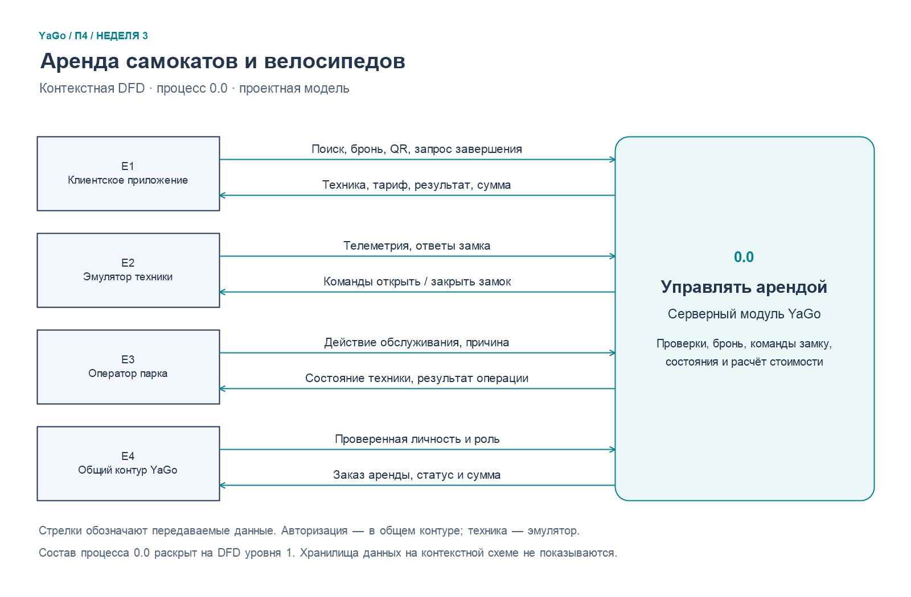

# П4 — результаты 3–4-й недель

**Проект:** YaGo — учебное суперприложение для такси, доставки и аренды самокатов/велосипедов  
**Исполнитель:** П4  
**Статус:** проектные материалы; модуль аренды ещё не реализован в текущем MVP.

## Состав

1. [DFD модуля аренды](week-03-dfd.md) — границы, внешние сущности, процессы, хранилища и потоки данных для основного сценария.
2. [Система классификации и кодирования информации](week-04-classification.md) — проектные классификаторы услуг, техники, статусов и тарифных категорий, правила формирования и проверки кодов.
3. [Исходник DFD в Mermaid](diagrams/scooter-dfd.mmd) — редактируемая диаграмма уровня 1.

## Готовые диаграммы

| Схема | Картинка для вставки | Вектор для печати |
|---|---|---|
| Контекстная DFD: клиент, сервер, техника, оператор | [PNG](diagrams/dfd-context.png) | [SVG](diagrams/dfd-context.svg) |
| DFD уровня 1: пять процессов и хранилища | [PNG](diagrams/dfd-level-1.png) | [SVG](diagrams/dfd-level-1.svg) |

Изображения встроены в документ недели 3. Для изменения схем служит [render-dfd.ps1](diagrams/render-dfd.ps1); он строит обе пары PNG/SVG и исходник Mermaid уровня 1. Запуск из корня проекта в Windows: powershell -NoProfile -ExecutionPolicy Bypass -File "п-4/diagrams/render-dfd.ps1". Скрипт использует System.Drawing без дополнительных пакетов.

## Основание и согласование

Материалы основаны на [спецификации модуля П4, неделя 2](../docs/week-02/p4/ru/04-scooter-specification.md), [черновике сущностей П3](../docs/week-02/p3/ru/03-database-entities.md) и [плане команды на 13 недель](../TZ_13weeks_team_plan.md). Для терминов и связей использованы сущности orders, rentals, vehicles, tariffs, zones; классификаторы не объявляют эти проектные решения реализованными.

## Ключевое ограничение

Коды в главе 4 — проектный словарь для будущей БД и API. До реализации П3/П5 должны согласовать физические ограничения и хранение справочников, П1 — авторизацию клиента/оператора, П2 — координаты и правила геозон. Неизвестные факты не следует кодировать фиктивными значениями: отсутствие заряда велосипеда хранится как NULL, отсутствие телеметрии — отдельным признаком/временем, ошибка команды — отдельным результатом.
